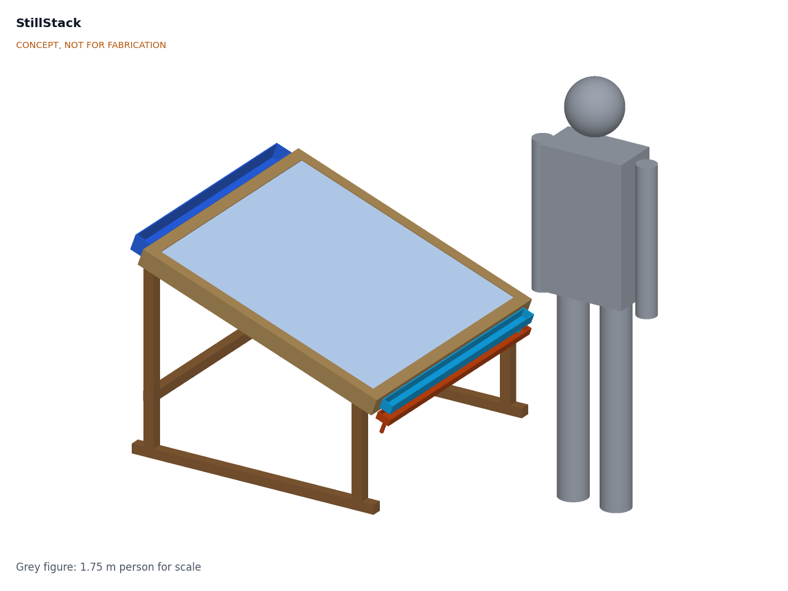
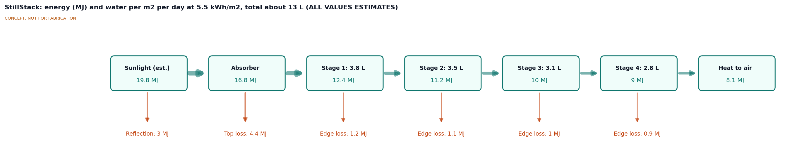
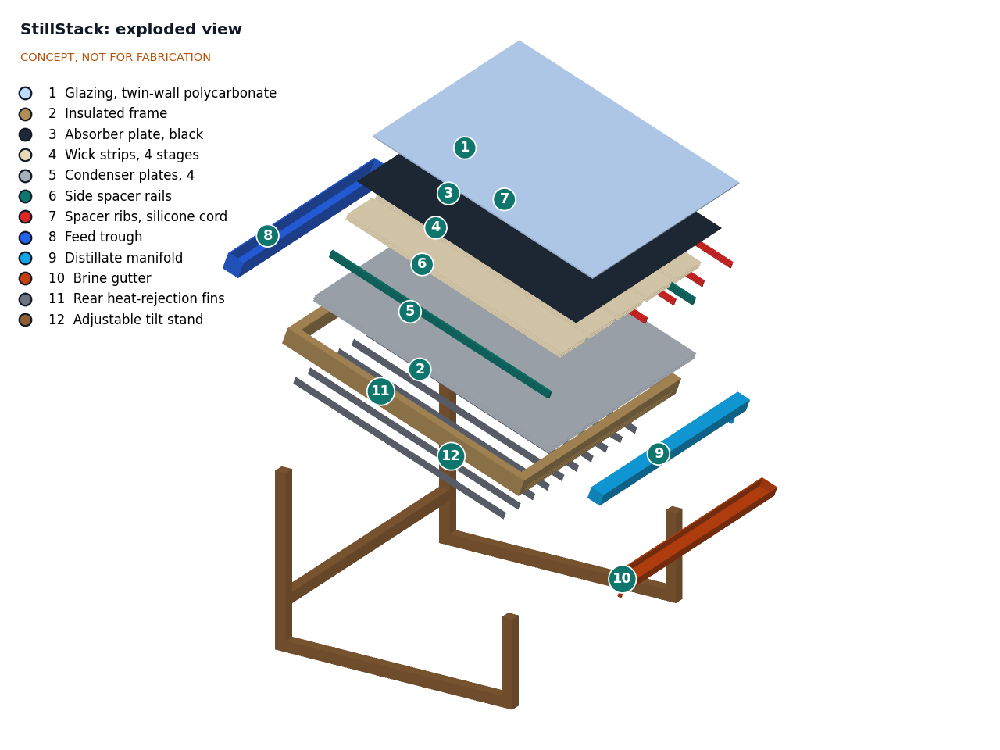

# StillStack design precis

StillStack is a tilted, glazed panel of 1 m2 containing four thin evaporation stages stacked like a sandwich: each stage is a wet cloth wick under a metal plate, a 6 mm vapor gap, and the next plate below. Sunlight heats the top plate, and the heat released when vapor condenses on each plate evaporates water from the wick under it, so the same solar energy is used four times. The TRL 3 calculation (SSK-CAL-001) gives about 10.6 L of distillate per m2 per day on a 5.5 kWh per m2 day, roughly two to three times a single-basin still, with a gained output ratio of about 1.3. Dry stagnation reaches about 140 °C (144 °C in calm air), so stages 1 and 2 use materials rated to 150 °C and a stagnation cover is supplied (SSK-DDR-002). The priced parts come to about $351 against the $320 budget, so R12 is not met on paper.

## How it works

1. **Collect.** Sunlight passes through twin-wall polycarbonate glazing (solar transmittance about 0.80) and is absorbed by a black-coated aluminum plate. A 25 mm air gap under the glazing limits heat loss from the top.
2. **Evaporate, stage 1.** Cloth wick strips bonded to the underside of the absorber are kept wet with feed water. Heat conducts through the plate and evaporates water from the wick.
3. **Condense and reuse.** The vapor crosses a 6 mm gap and condenses on the top face of the next plate. The latent heat released there (about 2.35 MJ per kg at stage temperatures) conducts through that plate into the wick under it, which evaporates water into stage 2. The cascade repeats through four stages, each running about 3.7 K cooler than the one above at noon. Between 85 and 91 % of the heat crossing each gap at noon is latent.
4. **Hold the gaps.** Each gap has two side rails (a polymer rated to 150 °C in stages 1 and 2, printed polycarbonate in stages 3 and 4) and four silicone-cord ribs running down the slope at 194 mm pitch, so the 0.5 mm plates sag no more than about 0.5 mm. The wicks are cut into five strips with 10 mm dry breaks at every rib and rail.
5. **Reject heat.** The bottom plate is the last condenser. Folded aluminum fins on its shaded underside reject the remaining heat (6.6 MJ per day, peak 277 W/m2) to air at about 28 K above ambient.
6. **Feed and drain.** Feed water drips from a user-filled container into a trough along the high edge. The wicks drape over the frame wall into the trough and are fed by capillary action and gravity down the slope. Excess salty water leaves the low end of each wick into a brine gutter that sits outboard of, and lower than, the distillate manifold.
7. **Collect distillate.** Condensate runs down each condenser plate, whose lip passes through a slot in the low wall into a lidded distillate manifold, and leaves through a spout into a clean covered container.

## Main components

Table 1. Main components, numbered to match the exploded view and bom/bom.csv.

| # | Component | Choice | Notes |
| --- | --- | --- | --- |
| 1 | Glazing | 6 mm twin-wall UV-stabilized polycarbonate, 1.0 x 1.0 m | Inner sheet reaches about 109 °C at dry stagnation |
| 2 | Insulated frame | 12 mm exterior plywood walls with 25 mm foil-faced stone wool liner, 1,074 mm square outside | Stone wool replaces PIR (SSK-DDR-002) because the absorber edge reaches about 144 °C at dry stagnation |
| 3 | Absorber plate | 0.5 mm aluminum, high-temperature matte black paint on top | Stage 1 evaporator surface underneath |
| 4 | Wicks, 4 stages | Viscose-polyester or cotton nonwoven, about 1 mm, 1.0 x 1.25 m, cut into five strips | Needs a permeability of 3.0 x 10^-11 m2 or more and must tolerate 150 °C dry; product not yet selected |
| 5 | Condenser plates, 4 | 0.5 mm aluminum with a food-contact coating on the condensing face; 77 mm lip into the manifold | Coating rated to 150 °C on plates 1 and 2; product not yet selected (awaiting Amish) |
| 6 | Side spacer rails | 12 x 7 mm, two per gap: stages 1 and 2 in a polymer rated to 150 °C or more (PPS or high-heat polycarbonate copolymer); stages 3 and 4 in printed polycarbonate | Split by SSK-DDR-002; ASA excluded by the stagnation temperature |
| 7 | Spacer ribs | 7 mm food-grade silicone cord, four per gap at 194 mm pitch | Decided (SSK-DDR-002) |
| 8 | Feed trough | PVC or HDPE rain gutter section with end caps and drip valve | Fed from a user-filled container |
| 9 | Distillate manifold | Food-grade PP or HDPE channel with lid and silicone outlet tube | Separate outlet from the brine |
| 10 | Brine gutter | PVC gutter outboard of and below the distillate manifold, with drain hose | Brine to a soak-away or evaporation pond |
| 11 | Rear heat-rejection fins | Ten folded 0.5 mm aluminum strips, 30 mm deep | On the shaded underside of the bottom plate |
| 12 | Adjustable tilt stand | 45 x 45 mm timber; front pivot at 350 mm; rear struts 0.53 to 0.94 m | 10 to 35 deg (R11) |
| 13 | Sealant, fasteners and tubing | NSF/ANSI 51 or 61 silicone, stainless screws, silicone tube | Not shown in the model |
| 14 | Stagnation cover | Opaque white or aluminized tarpaulin 1.3 x 1.3 m with elastic edge cord | Fitted when the feed runs out and before maintenance; not shown in the model |

## Key numbers

All values come from SSK-CAL-001 (quasi-steady stack model integrated over a 5.5 kWh per m2 design day) and are calculated estimates, not measurements.

Table 2. Key numbers per m2 of aperture.

| Quantity | Value | Requirement |
| --- | --- | --- |
| Solar input | 19.8 MJ per day | |
| Optical loss | 4.8 MJ (τα = 0.76) | |
| Top loss | 4.5 MJ | |
| Feed heating lost with brine | 3.8 MJ | |
| Heat rejected at the bottom | 6.6 MJ, peak 277 W/m2 | |
| Distillate by stage | 3.45, 2.97, 2.60, 2.29 L | |
| Daily distillate | 10.6 L after warm-up deduction (11.3 L quasi-steady); range 9.0 to 13.6 L for 4.5 to 6.5 kWh per m2 | R1 met, 6 % margin |
| Gained output ratio | 1.26 to 1.34 | R2 at risk |
| Plate temperatures at noon | 73, 69, 66, 62 and 58 °C | |
| Dry stagnation, stage 1 | about 140 °C (144 °C calm); stage 3 about 110 °C calm | R8 at risk (150 °C and 110 °C ratings) |
| Feed and brine | about 28.7 L feed, 17.2 L brine per day; brine 58 to 67 g/L | R6 at risk (wick feed) |
| Panel mass | 16.7 kg dry, 20.7 kg wet; stand 7.1 kg | R9 met |
| Parts cost | $351.20 against $320 | R12 not met |

## Key design choices

These choices were decided by Amish on 2026-09-25 (SSK-DDR-001 and SSK-DDR-002).

- **Four stages with 6 mm gaps.** Decided. Three stages would give about 9.1 L per day; six stages about 14.9 L on paper.
- **Air-cooled fins under the bottom plate.** Decided. The bottom plate stays near 58 °C at noon, which is adequate for four stages.
- **Aluminum plates with a food-contact coating on the condensing face.** Decided. The coating product is not yet selected; see open questions.
- **Spacers in ASA or polycarbonate, not PETG.** Decided. SSK-CAL-001 shows that only polycarbonate is close to adequate, because stages 1 to 3 exceed the rating of ASA at dry stagnation.
- **Tilt of 20 deg on an adjustable stand.** Decided. The stand pivots at the low edge and sets the tilt with rear struts from 10 to 35 deg.
- **Aperture of 1 m2 and a budget of $320.** Decided. The budget was kept at $250 in SSK-DDR-001 and raised to $320 in SSK-DDR-002. The priced BOM ($351.20) still exceeds it.
- **Intermediate silicone-cord ribs.** Decided (SSK-DDR-002). The calculation shows that side rails alone cannot hold a 6 mm gap; silicone is rated well above the stagnation temperature and wets poorly.
- **Dry stagnation handled by materials and a cover.** Decided (SSK-DDR-002). Everything in stages 1 and 2 is rated to 150 °C or more, the frame liner is stone wool, and an opaque stagnation cover is supplied with a shade rule.

## Safety

> **Safety:** Distillate is not certified drinking water. Test it before drinking (at least conductivity and E. coli), store it in a clean covered container, and disinfect it (for example with chlorine) before use. Stages run below pasteurization certainty, brine can wick or splash into distillate channels, and volatile contaminants in the feed can carry over with the vapor. Long-term drinking of distillate needs remineralization.

> **Safety:** Use only food-contact rated materials on every surface that touches distillate: coated or stainless plates, PP or HDPE channels, and NSF/ANSI 51 or 61 silicone. Never use lead-containing solder, treated timber or recycled containers of unknown history in the water path.

> **Safety:** The absorber reaches about 80 °C in normal use and about 140 °C when the wicks run dry. Do not touch the glazing or open the stack in sun. Fit the stagnation cover (BOM line 14) before maintenance and whenever the feed container runs empty, and never leave a dry panel uncovered in sun.

> **Safety:** The panel and stand can overturn at about 17 m/s of wind. Anchor or ballast the stand.

- Brine is strongly saline. Discharge it away from crops, wells and soil that must stay fresh.

## Open questions

- Which food-contact coating survives wet, salty service at 80 °C on aluminum, and at what cost (R7)?
- Which wick fabric has a permeability of 3.0 x 10^-11 m2 or more, and how is it held so that one person can remove it in 30 min (R6, R10)?
- Which rail polymer (PPS or a high-heat polycarbonate copolymer) meets the 150 °C rating at the lowest cost, and can stage 3 keep any margin over 110 °C in calm air (R8)?
- How should R12 be met at the $320 budget, now $31.20 short: a budget of about $355 (recommended), cheaper rails and cover, or excluding the cover and stand? Proposed, awaiting Amish.
- How do the wick tails leave the low end over the lidded distillate manifold while keeping a 10 mm air break (R4)?
- Identify a coastal community or NGO partner for co-design (still open, no recommendation).

Design data: [general arrangement SSK-DWG-002](../cad/drawings/SSK-DWG-002.pdf), [sizing SSK-CAL-001](04-calcs/01-sizing.md), [parametric model](../cad/src/model.py), [blueprint sheet](../media/concept-blueprint.pdf), [interactive 3D model](../media/viewer.html), [cutaway](../media/cutaway.png).
