# StillStack prototype build plan

**Plan, not yet built.** How to build the first proof-of-concept prototype, component by component. Building and testing to it is TRL 4 work. Decisions still to be made are kept in the design decisions register ([docs/06-design-decisions.md](06-design-decisions.md)), not here.

## 1. What you are building

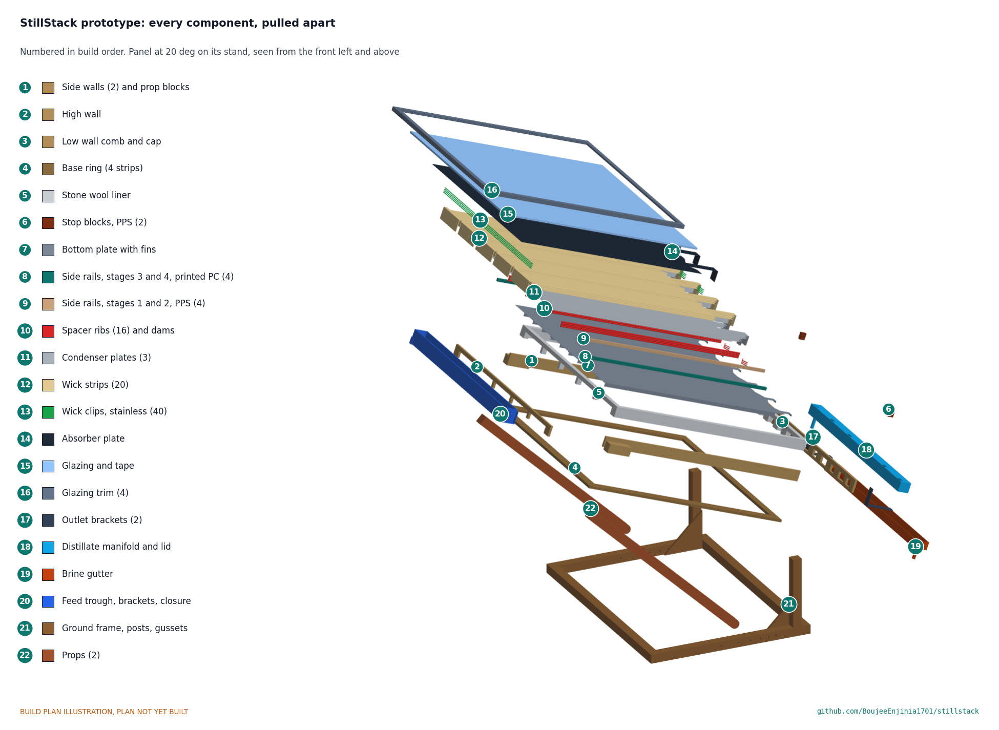

*Figure 1. Every component pulled apart and numbered in build order, with the panel at 20° on its stand.*

The prototype is one 1 m2 StillStack panel on its tilting stand. The panel is a shallow plywood box lined with stone wool, closed by twin-wall glazing under an aluminium trim. Inside it lies the stack: a black absorber plate on top, three condenser plates and a bottom plate below it, with a cloth wick clipped under each of the top four plates and 6 mm gaps held by plastic rails and silicone cords. Feed water runs from a trough at the high edge into the wicks; at the low edge, tongues cut from the plates lead distillate into a lidded manifold and brine into a gutter beyond it. Figure 1 shows the 22 components in the order you make or fit them. Most are made in a small workshop: the plywood walls, base ring and stand, the five aluminium plates and the fins, the rails, wicks, trim and brackets. The glazing, liner board, silicone cord, gutters, manifold, fixings and sealant are bought and cut or drilled. The work is sawing and drilling plywood and timber, cutting and folding thin aluminium sheet with snips, cutting fabric and board, a little 3D printing, and sealing with silicone. The parts cost about USD 416 from the bill of materials.

> **Safety:** In sun the absorber passes 80 °C, and about 140 °C if the wicks run dry. Build indoors or in shade, keep the stagnation cover on whenever the panel faces the sun without feed water, and never touch the glazing or open the stack in sun. Cut aluminium edges are sharp: deburr everything and wear gloves. Stone wool sheds fibres: cut it with gloves, glasses and a dust mask. The distillate is not drinking water until it has been tested (section 6).

## 2. What changed to make it buildable

The concept showed what the still does; some of its parts could not be made, fixed or put together as drawn. Each change below keeps what the still does, and all of them are recorded in decision record SSK-DDR-003, which Amish accepted on 2026-10-02 with two exceptions, both now in the model and the pictures: a 4 mm downturned lip on each condensing plate's high edge, and clips in place of the silicone dots for the wicks (sections 3.7, 3.10 and 3.11).

*Table 1. Changes from the concept.*

| Component | The concept had | The buildable design has | Why |
| --- | --- | --- | --- |
| Stack support | A thin ledge along the two side walls only | A plywood base ring under all four walls with a 15 mm ledge; the bottom plate spans between the ledges on its bonded fins (Figure 16) | The whole stack is carried; the bottom plate sags about 0.5 mm |
| Low wall | Four 1 m long, 2 mm slits for the plate lips, leaving slivers of plywood | A comb with eleven open-topped notches and a separate cap strip (Figure 6) | Each plate drops in from above; lifting the cap lets the plates out again |
| Low edge of the plates | Full-width lips, with the brine exit not worked out | A zigzag edge: distillate tongues at the rib lines and corners, brine tongues at the strip centres carrying the wick tails over the closed manifold lid (Figures 21 and 22) | Brine and distillate never share an edge; every brine path keeps 10 mm or more from every distillate path |
| Stack against sliding | Nothing; the plates faced soft stone wool | Two stop blocks in the low corners of the liner (Figure 11) | A hard face for the stack's down-slope load |
| Glazing | A sheet the size of the opening, held by nothing | A larger sheet on foam tape on the wall tops, under a screwed aluminium trim (Figure 30) | Room to grow 4.8 mm when hot; no shade on the aperture |
| Feed | Wicks draped over a solid high wall into a loose trough | Five openings in the high wall; tails rise behind a foam closure into a trough on two brackets (Figure 4) | Feed reaches each stage; vapor stays in |
| Manifold and gutter | No support | Two outlet brackets on the low wall (Figure 34) | The gutter sits lower and further out than the manifold |
| Stand | Vertical rear struts that could not follow the panel's high edge as the tilt changes | Ground frame, front posts with gussets, a pivot bolt, and fixed props pinned at one of six holes (Figures 35 to 40) | Rigid at every tilt from 10° to 35°; the panel's weight stays well inside the frame |
| Plate high edge | Plain edge, with feed tails leaving 6 mm above the condensing face of the plate below | Four 7 mm tabs bent down 4 mm on each condensing plate's high edge, on the rib lines, with slots in the base ring for the bottom plate's tabs (Figure 26) | Gives feed water at the high edge a drip edge away from the condensing face; the wicks pass between the tabs |
| Wick fixing | Wicks bonded under the plates | Two stainless clips per wick strip, one at the high edge and one on the brine tongue, with no adhesive (Figures 24 to 27) | The wicks lift out for rinsing; no adhesive on the wet side |
| Fins, corners, ribs | No fixing method | Fins bonded with silicone adhesive; corners glued and screwed; ribs stopped 6 mm short of the high edge and 8 mm short of the tongue tips | Plain workshop methods |

## 3. Making the components

Make and check each component before the assembly step that needs it. Sizes are in millimetres. "High end" is the feed end (up the slope), "low end" is the outlet end; "across" means across the slope, measured from the centre line. Workshop tolerance is 1 mm on plywood and timber and 0.5 mm on the plates and rails unless a step says otherwise; drawings do not carry tolerances before TRL 4.

### 3.1 Side walls (make 2: a left and a right)

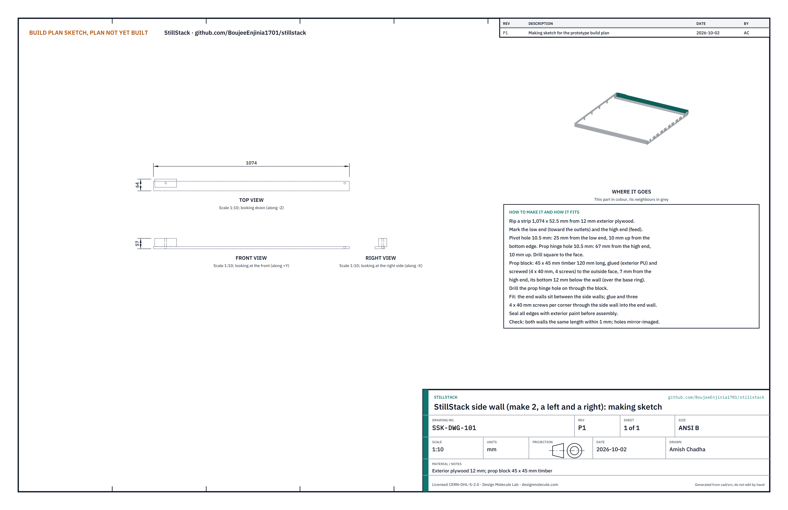

*Figure 2. Side wall making sketch (SSK-DWG-101), with its prop block.*

**What it is and what it is made from.** The two long sides of the box. Each carries the front pivot near its low end and a prop block near its high end. Exterior plywood 12 mm; prop block 45 x 45 mm treated timber.

**How to make it.**

1. Rip two strips 1,074 x 52.5 mm from the plywood panel. Mark the low end and the high end on each, and make one a mirror of the other.
2. Pivot hole: 10.5 mm, 25 mm from the low end and 10 mm up from the bottom edge. Drill square to the face.
3. Prop block: cut 120 mm of 45 x 45 mm timber. Glue it (exterior polyurethane) and screw it (four 4 x 40 mm screws) to the outside face, 7 mm from the high end, with its bottom 12 mm below the wall's bottom edge so it also covers the edge of the base ring.
4. Prop hinge hole: 10.5 mm, 67 mm from the high end and 10 mm up, through the wall and the block together.
5. Seal all edges with exterior paint.

**How it fits the parts next to it.**

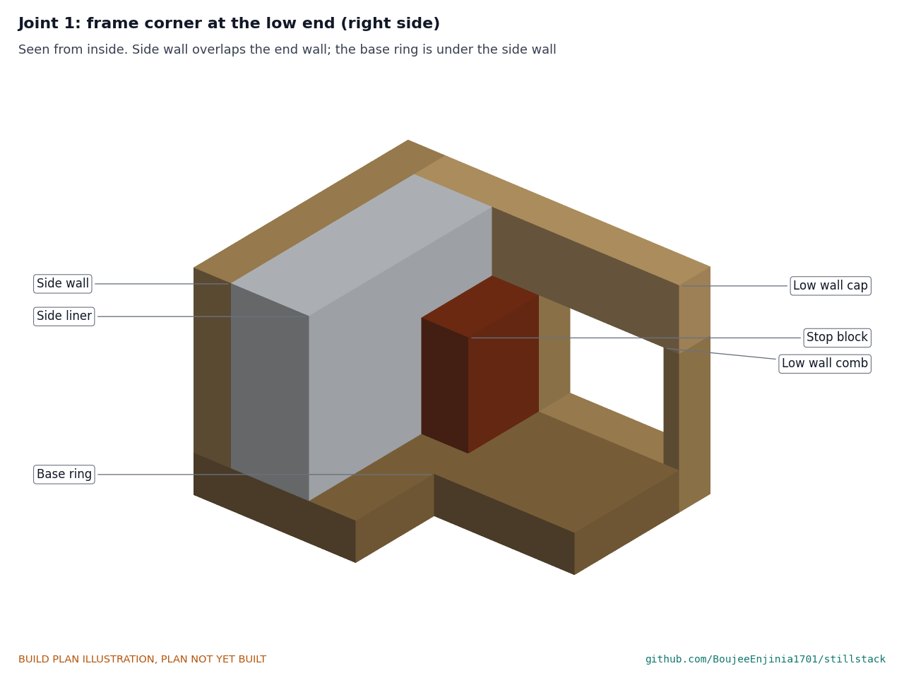

*Figure 3. The side wall overlaps the end of the low wall; the base ring runs under it.*

The high wall and the low wall comb sit between the side walls. Each corner is glued and fixed with three 4 x 40 mm screws through the side wall into the end wall. The base ring is screwed up into the bottom edges, and the glazing trim later ties the tops.

**Check before moving on.** Both walls are the same length within 1 mm, and the holes are mirror images.

### 3.2 High wall (feed end)

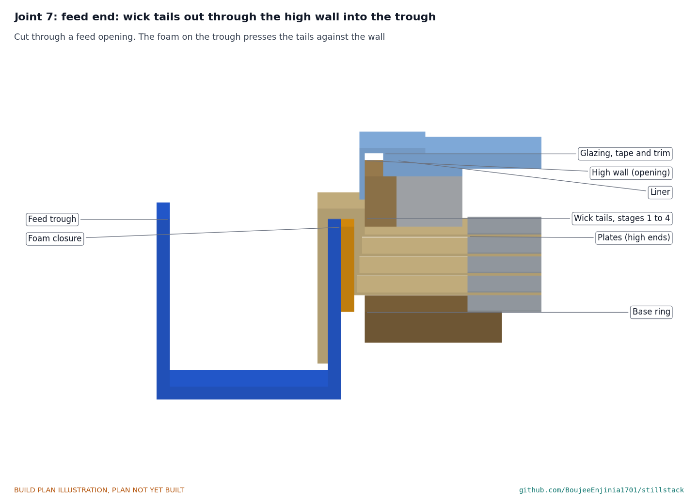

*Figure 4. The wick tails leave through an opening in the high wall, rise behind the foam closure and drop into the trough.*

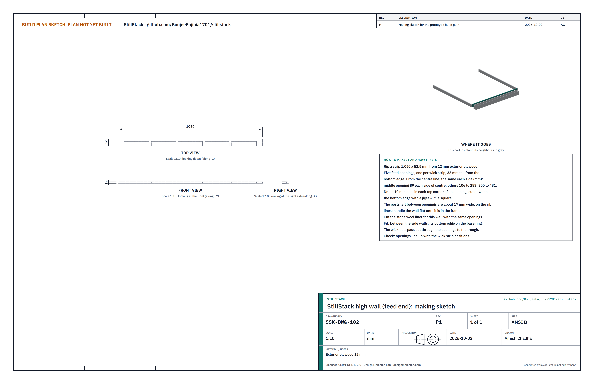

*Figure 5. High wall making sketch (SSK-DWG-102). Figure 7 gives every opening position.*

**What it is and what it is made from.** The wall across the high end, with one opening for each of the five wick strips. Exterior plywood 12 mm.

**How to make it.**

1. Rip a strip 1,050 x 52.5 mm.
2. Mark five openings 33 mm tall from the bottom edge, as Figure 7 shows: the middle one 89 mm each side of the centre line, the others from 106 to 283 mm and from 300 to 481 mm each side.
3. Drill a 10 mm hole in each top corner of an opening, cut down to the bottom edge with a jigsaw and file square. The posts left between openings are about 17 mm wide; handle the wall flat until it is in the frame.

**How it fits the parts next to it.** It stands between the side walls on the base ring. The tails of all four wicks pass out through its openings (Figure 4); the trough hangs on two brackets screwed to its solid ends, outside the outermost openings.

**Check before moving on.** Each opening lines up with a wick strip position (Figure 7).

### 3.3 Low wall comb and cap (outlet end)

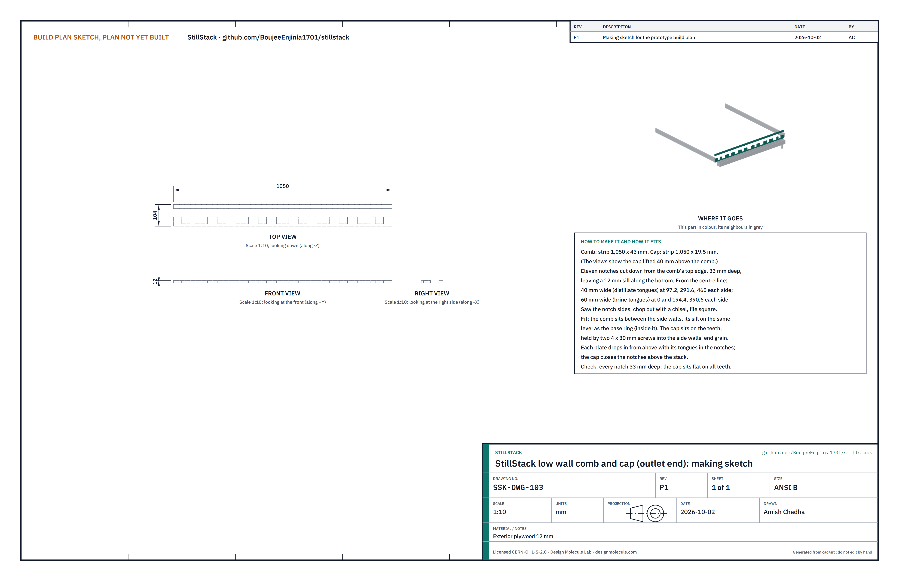

*Figure 6. Low wall comb and cap making sketch (SSK-DWG-103); the cap is drawn lifted above the comb.*

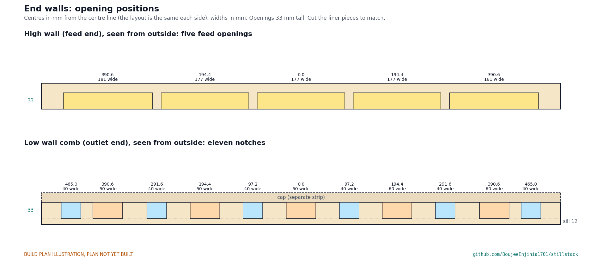

*Figure 7. Every opening and notch in the end walls, seen from outside.*

**What it is and what it is made from.** The wall across the low end, made in two pieces so the plates can drop in from above: a comb, whose notches take the plate tongues, and a cap that closes the notches above the stack. Exterior plywood 12 mm.

**How to make it.**

1. Comb: rip a strip 1,050 x 45 mm. Cap: rip a strip 1,050 x 19.5 mm.
2. Mark eleven notches on the comb, cut down from its top edge, 33 mm deep, leaving a 12 mm sill along the bottom (Figure 7): six 40 mm wide for the distillate tongues, centred 97.2, 291.6 and 465 mm each side of the centre line; five 60 mm wide for the brine tongues, centred on the centre line and 194.4 and 390.6 mm each side.
3. Saw the sides of each notch, chop out the waste with a chisel and file square.

**How it fits the parts next to it.** The comb stands between the side walls, its sill level with the base ring and outside it. Each plate's tongues drop into the notches; the bottom plate's tongues rest on the sill. The cap sits on the teeth over the stack and is held by two 4 x 30 mm screws into the side walls' end grain, so it can be lifted off.

**Check before moving on.** Every notch is 33 mm deep; the cap sits flat on all the teeth.

### 3.4 Base ring

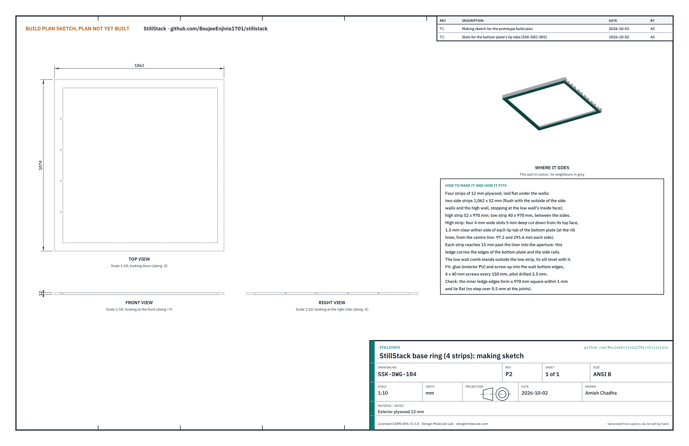

*Figure 8. Base ring making sketch (SSK-DWG-104).*

**What it is and what it is made from.** Four flat strips under the walls. Their inner edges stand 15 mm into the aperture as a ledge that carries the stack. Exterior plywood 12 mm.

**How to make it.**

1. Cut two side strips 1,062 x 52 mm, one high strip 52 x 970 mm and one low strip 40 x 970 mm.
2. Pilot drill 2.5 mm every 150 mm along each strip's centre line.
3. In the high strip, cut four slots 4 mm wide and 5 mm deep down from the top face, centred 97.2 and 291.6 mm each side of the centre line (the rib lines), so the bottom plate's lip tabs have room. Saw the two sides and chisel out.

**How it fits the parts next to it.** The side strips lie flush with the outside of the side walls and the high wall and stop at the inside face of the low wall comb. The high and low strips fit between them. Glue and screw (4 x 40 mm) up into the wall edges.

**Check before moving on.** The inner ledge edges form a 970 mm square within 1 mm and lie flat, with no step over 0.5 mm at the joints.

### 3.5 Stone wool liner

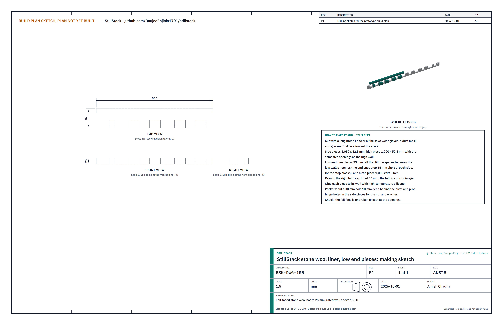

*Figure 9. Liner making sketch, low end pieces (SSK-DWG-105); right half drawn, cap piece lifted.*

**What it is and what it is made from.** Insulation inside the walls. Foil-faced stone wool board 25 mm, rated well above 150 °C.

**How to make it.**

1. Cut with a long bread knife or a fine saw, foil face toward the stack: two side pieces 1,050 x 52.5 mm; a high piece 1,000 x 52.5 mm with the same five openings as the high wall; ten low blocks 33 mm tall that fill the spaces between the low wall's notches (Figure 7); and a low cap piece 1,000 x 19.5 mm.
2. In each side piece, cut a pocket 30 mm across and 10 mm deep behind the pivot hole and the prop hinge hole, for the nut and washer.

**How it fits the parts next to it.** Each piece is glued to its wall with high-temperature silicone, its bottom on the base ring. The two end blocks stop 15 mm short of each side to leave room for the stop blocks; the cap piece is glued to the cap.

**Check before moving on.** The foil face is unbroken except at the openings and pockets.

### 3.6 Stop blocks (make 2)

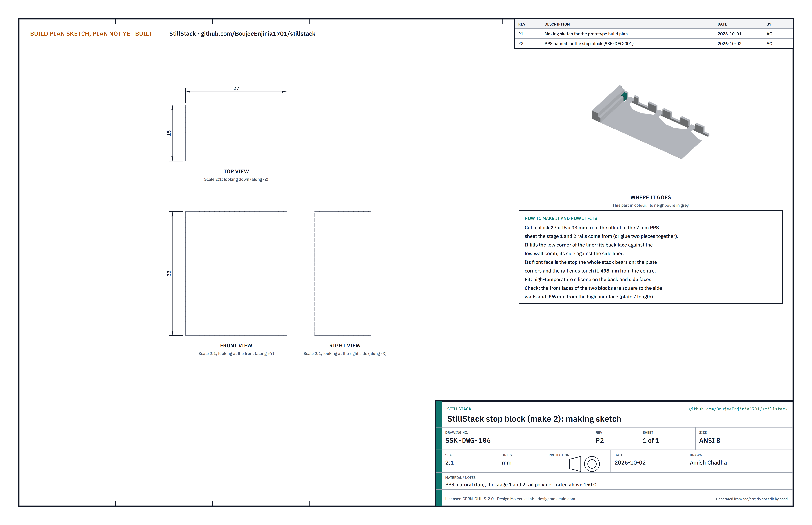

*Figure 10. Stop block making sketch (SSK-DWG-106).*

**What it is and what it is made from.** A block in each low corner that the whole stack bears on, so it cannot slide down the slope. PPS, natural (tan), the stage 1 and 2 rail polymer, rated above 150 °C (decided 2026-10-02).

**How to make it.** Cut a block 27 x 15 x 33 mm from the offcut of the 7 mm PPS sheet the stage 1 and 2 rails come from, or glue two pieces of it together with high-temperature silicone.

**How it fits the parts next to it.**

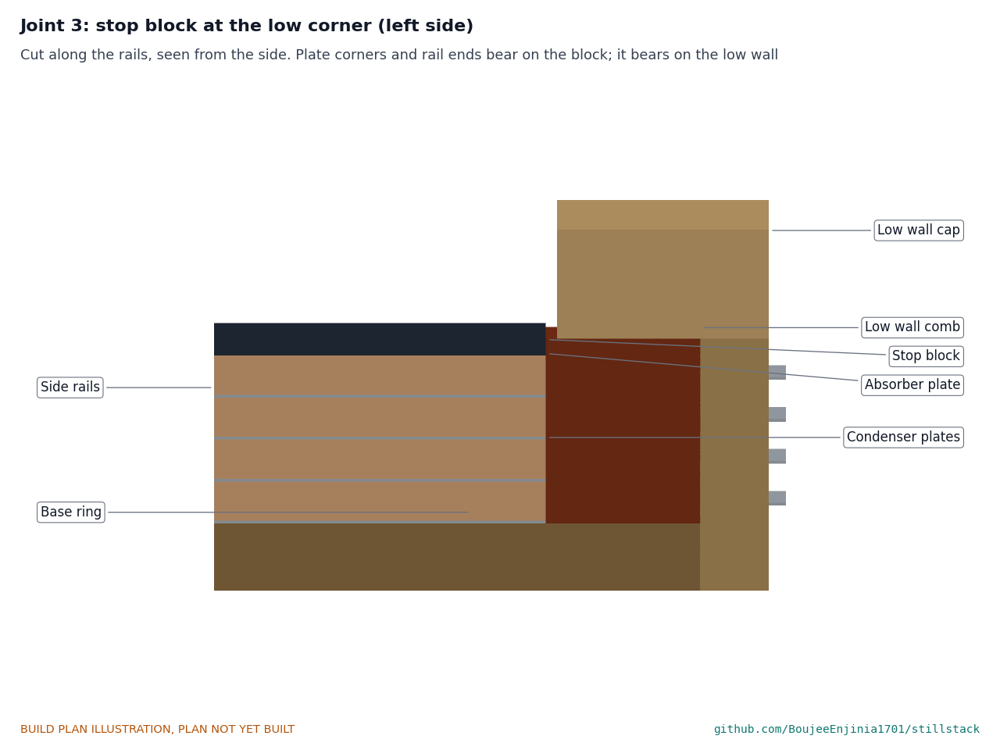

*Figure 11. Cut along the rails: the plate corners and rail ends bear on the block, and the block bears on the low wall.*

The block fills the liner's low corner: its back against the low wall comb, its side against the side liner, glued with high-temperature silicone. Its front face is 996 mm from the high liner face, the length of a plate.

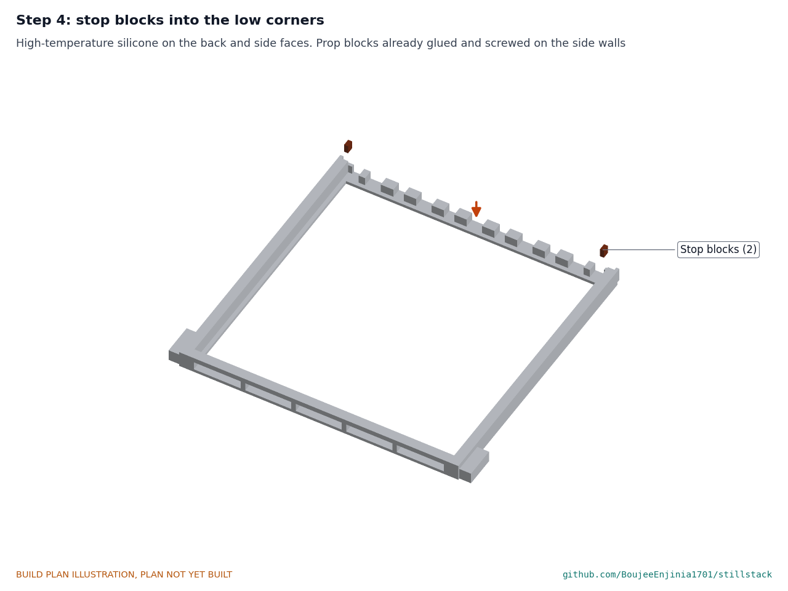

*Figure 12. Where the stop blocks go.*

**Check before moving on.** Both front faces are square to the side walls and 996 mm from the high liner face.

### 3.7 Bottom plate and fins

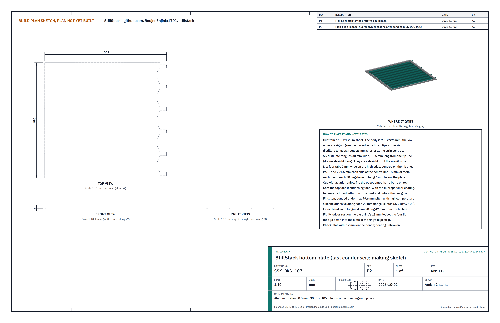

*Figure 13. Bottom plate making sketch (SSK-DWG-107), tongues drawn straight.*

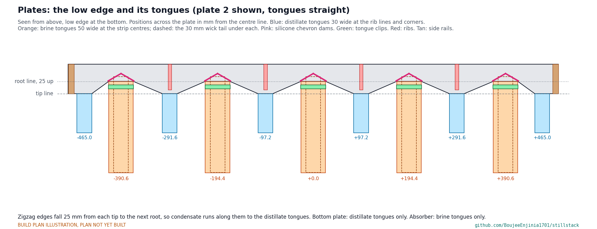

*Figure 14. The zigzag low edge and the tongue positions, shared by all five plates.*

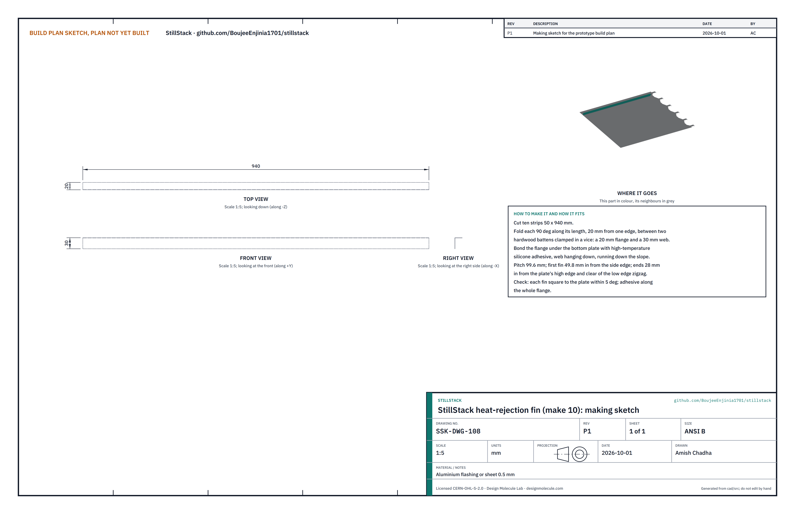

*Figure 15. Fin making sketch (SSK-DWG-108).*

**What it is and what it is made from.** The last condenser: stage 4 condenses on its top face, and the fins underneath shed the remaining heat to the air. Aluminium sheet 0.5 mm, 3003 or 1050, with a fluoropolymer (PTFE or PFA type) cookware coating on its top face, certified for drinking-water contact and rated to 150 °C dry; fins of 0.5 mm aluminium flashing.

**How to make it.**

1. From a 1.0 x 1.25 m sheet (the blank, tongues and lip included, is 1,224 mm long, so it fits), cut a body 996 x 996 mm whose low edge is the zigzag of Figure 14: tips at the six distillate tongue lines, falling 25 mm to a flat root at each strip centre.
2. Leave six distillate tongues 30 mm wide and 56.5 mm long beyond the tip line, straight for now. Mark a bend line 47 mm from the tip line on each.
3. Lip: on the high edge leave four tabs 7 mm wide, centred 97.2 and 291.6 mm each side of the centre line (the rib lines), each 5 mm long beyond the edge. Bend each 90° down over a steel bar so it hangs 4 mm below the plate.
4. File every edge smooth and free of burrs.
5. Coat the top face, tongues included, with the coating, after the tabs are bent.
6. Fins: cut ten strips 50 x 940 mm and fold each 90° along its length 20 mm from one edge, between two hardwood battens clamped in a vice.
7. Bond each fin's 20 mm flange under the plate with high-temperature silicone adhesive, web hanging down and running down the slope, at 99.6 mm pitch with the first 49.8 mm in from a side edge and the ends 28 mm in from the high edge.

**How it fits the parts next to it.**

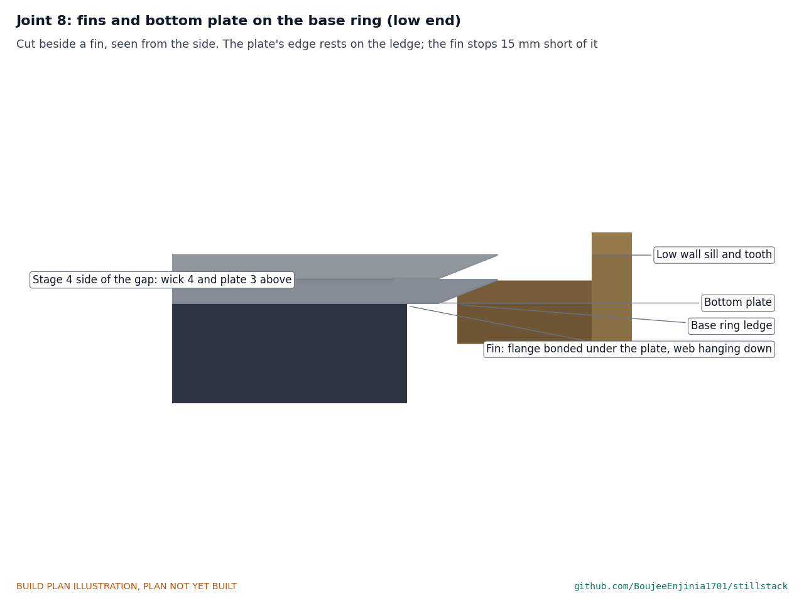

*Figure 16. Cut beside a fin: the plate's edge rests on the ledge; the fin stops 15 mm short of it.*

The plate's four edges rest on the base ring's ledge; its corners touch the stop blocks; its tongues lie on the low wall's sill in the notches.

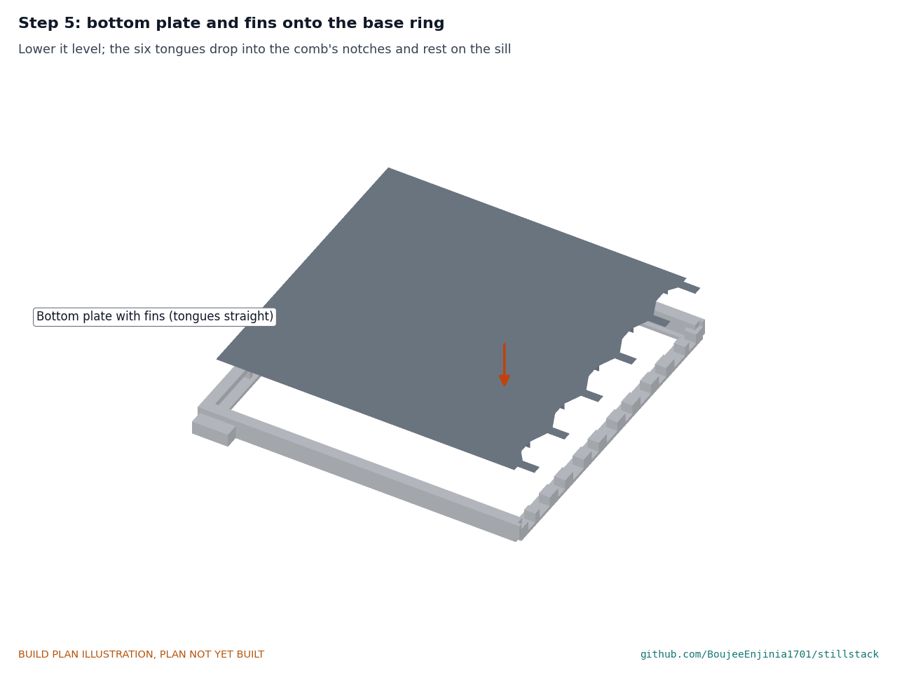

*Figure 17. The bottom plate is lowered level onto the ledge.*

**Check before moving on.** The plate is flat within 2 mm on the bench; the coating is unbroken; every fin is square to the plate within 5° and bonded along its whole flange.

### 3.8 Side rails (make 8)

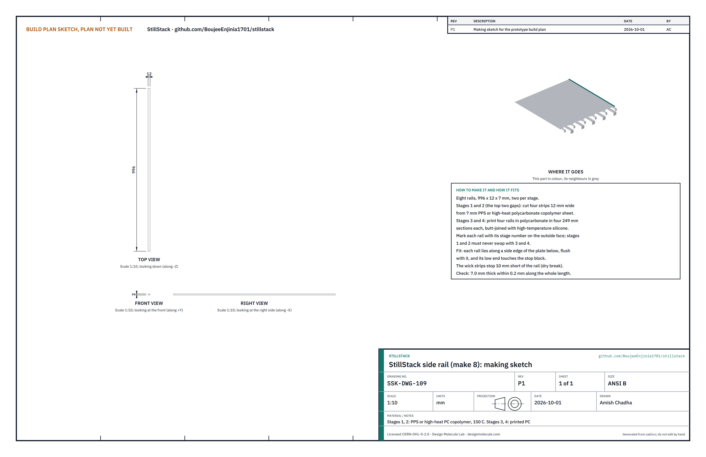

*Figure 18. Side rail making sketch (SSK-DWG-109).*

**What it is and what it is made from.** Two rails per gap, along the side edges, that hold the plates 7 mm apart (6 mm gap plus the 1 mm wick). Stages 1 and 2 (the top two gaps): natural (tan) PPS rated above 150 °C (decided 2026-10-02). Stages 3 and 4: printed polycarbonate in teal, so the two kinds never swap.

**How to make it.**

1. Stages 1 and 2: cut four strips 996 x 12 mm from 7 mm PPS sheet; keep the offcut for the stop blocks.
2. Stages 3 and 4: print four rails 996 x 12 x 7 mm in teal polycarbonate, each in four 249 mm sections, and butt-join the sections with high-temperature silicone.
3. Mark each rail with its stage number on the outside face.

**How it fits the parts next to it.**

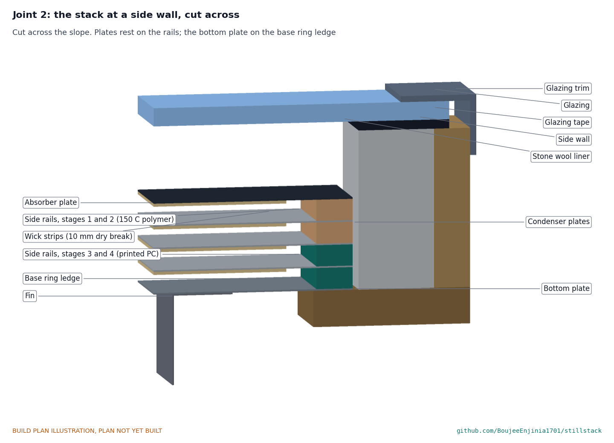

*Figure 19. Cut across the slope: each rail lies along a side edge of the plate below and carries the plate above; the wicks stop 10 mm short of the rails.*

Each rail lies flush with a side edge of the plate below, its low end touching the stop block. The plate above rests on it. The wick strips stop 10 mm short of the rails, a dry break that keeps brine from creeping along the rail.

**Check before moving on.** Each rail is 7.0 mm thick within 0.2 mm along its whole length; stages 1 and 2 are never swapped with 3 and 4.

### 3.9 Spacer ribs and chevron dams

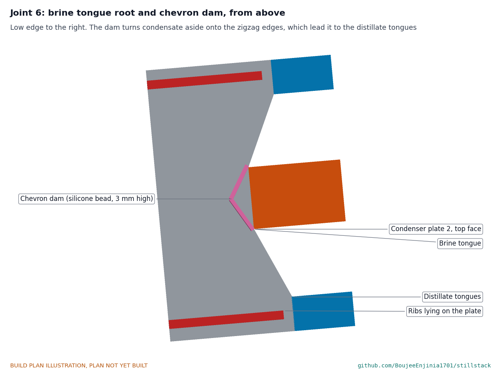

*Figure 20. A rib on a rib line, and the silicone chevron at a brine tongue root.*

**What they are and what they are made from.** Ribs: four 7 mm food-grade silicone cords per gap, running down the slope on the rib lines, which stop the 0.5 mm plates sagging between the rails. Dams: a bead of food-grade silicone on the top face of each condenser plate at each brine tongue root.

**How to make them.**

1. Cut sixteen lengths of cord 988 mm long.
2. Dams: after each condenser plate is in place (steps 6 to 8), run a bead 3 mm high in a V on its top face at each brine tongue root: the point 16 mm up the slope from the root, the two legs ending at the root's corners (Figures 14 and 20).

**How they fit the parts next to them.** The ribs lie on the rib lines (97.2 and 291.6 mm each side of the centre line), from the high edge to 8 mm short of the tongue tips, between the wick strips' dry breaks. The dams turn condensate running down the plate aside onto the zigzag edges, which lead it to the distillate tongues.

**Check before moving on.** Each rib lies straight on its line; each dam is continuous and its legs meet the root corners.

### 3.10 Condenser plates 1 to 3

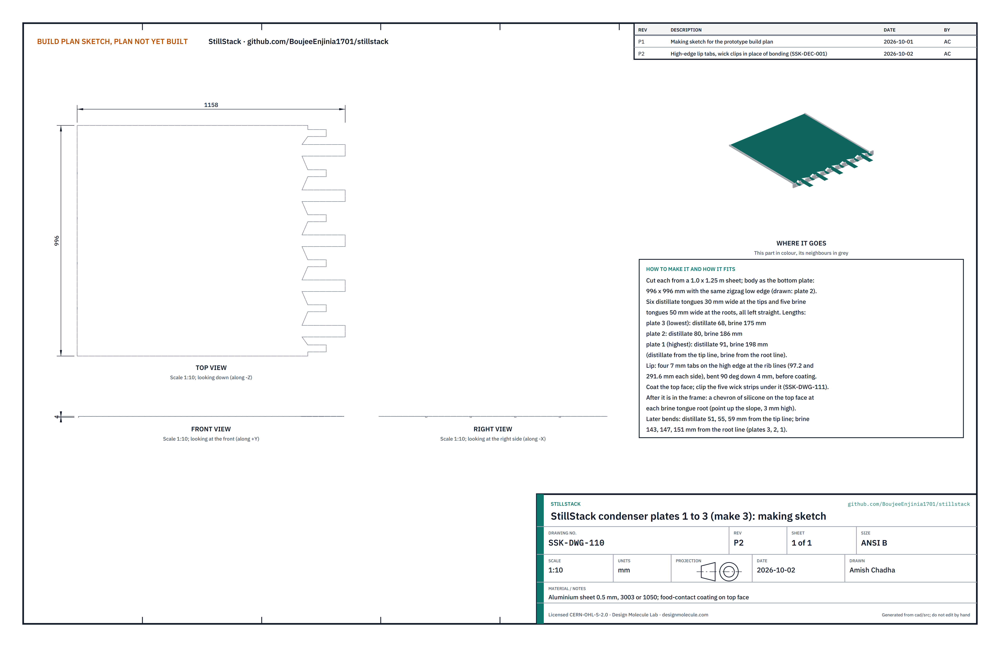

*Figure 21. Condenser plate making sketch (SSK-DWG-110), plate 2 shown with its tongues straight.*

**What they are and what they are made from.** The three plates between the absorber and the bottom plate. Each condenses the stage above on its top face and carries the wick of the stage below on its underside. Aluminium sheet 0.5 mm with the fluoropolymer coating on the top face (as for the bottom plate).

**How to make them.**

1. From a 1.0 x 1.25 m sheet each, cut the same 996 x 996 mm body, lip tabs and zigzag low edge as the bottom plate (Figure 14).
2. Leave six distillate tongues 30 mm wide at the tips and five brine tongues 50 mm wide at the roots, all straight. Lengths, distillate from the tip line and brine from the root line: plate 3 (lowest) 68 and 175 mm; plate 2, 80 and 187 mm; plate 1 (highest), 91 and 198 mm.
3. Mark the bend lines: distillate 51, 55 and 59 mm from the tip line, brine 143, 147 and 151 mm from the root line, for plates 3, 2 and 1.
4. Lip: on the high edge leave four tabs 7 mm wide at the rib lines (97.2 and 291.6 mm each side of the centre line) and bend each 90° down so it hangs 4 mm below the plate. The tabs stand clear of the wick strips and of the rib ends.
5. Deburr, coat the top face after the tabs are bent, and clip the five wick strips of the stage below under it (section 3.11).

**How they fit the parts next to them.**

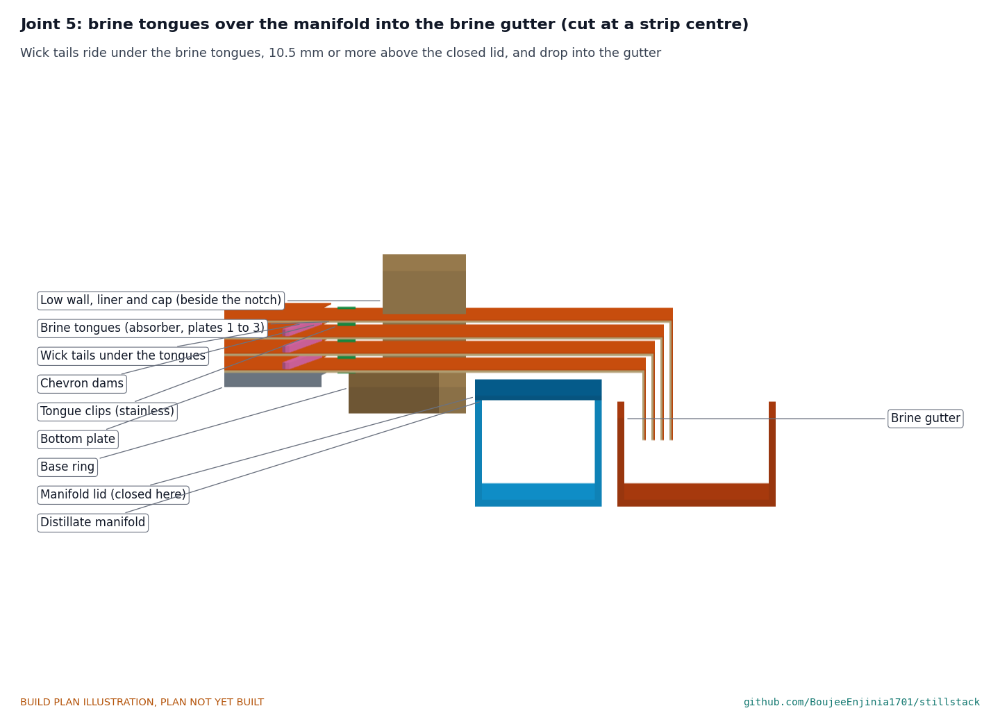

*Figure 22. Cut at a strip centre: each brine tongue carries its wick tail over the closed manifold lid and turns down into the brine gutter.*

Each plate rests on the rails and ribs of the gap below, its corners against the stop blocks and its tongues in the low wall's notches. Once the manifold and gutter are fitted, the distillate tongues are bent down into the manifold and the brine tongues down into the gutter, each 4 mm outside the one below (steps 15 and 17). The lowest brine tongue's wick tail passes 10.5 mm above the lid; the nearest distillate tongue is 44 mm away to the side.

**Check before moving on.** Each plate is flat within 2 mm, its coating unbroken, its tongues the right length for its level.

### 3.11 Wick strips (make 20: five per stage)

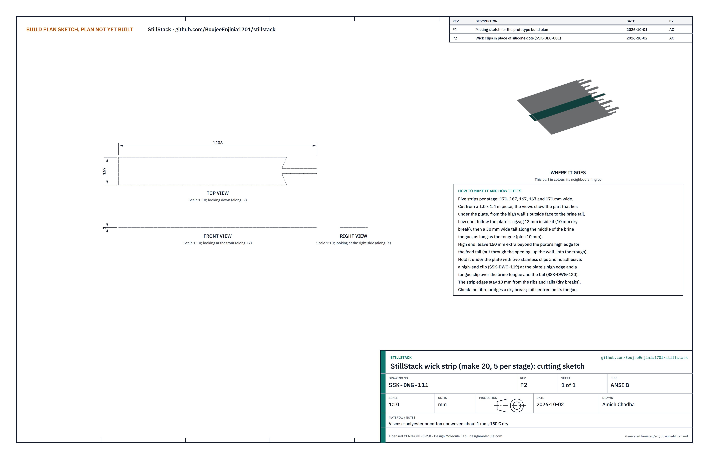

*Figure 23. Wick strip cutting sketch (SSK-DWG-111): the part under the plate, with the brine tail.*

**What they are and what they are made from.** The wet cloth that evaporates water in each stage, fed from the trough at the high end, with its excess leaving as brine at the low end. Nonwoven about 1 mm thick that tolerates 150 °C dry.

**How to make them.**

1. For each stage cut a 1.0 x 1.4 m piece into five strips: 171, 167, 167, 167 and 171 mm wide.
2. Low end: cut each strip to follow its plate's zigzag edge 13 mm inside it (a 10 mm dry break), then leave a 30 mm wide tail along the middle of the brine tongue, as long as the tongue plus 10 mm.
3. High end: leave 150 mm beyond the plate's high edge for the feed tail.
4. Lay the plate face down on a clean table. Slide a high-end clip (Figure 24) onto each strip so its bar lies under the wick and its ears hook round the plate edge in the dry breaks beside the strip, then slide a tongue clip (Figure 25) onto the brine tongue so it holds the tail centred under the tongue. Use no adhesive, so the wicks lift out for rinsing.

**How they fit the parts next to them.** Each strip lies between a rail and a rib, or between two ribs, with 10 mm of dry plate on each side; the clip ears sit in those dry breaks, beside the lip tabs (Figure 26). The feed tail leaves through the high wall opening for its strip (Figure 4); the brine tail rides under its brine tongue (Figure 22).

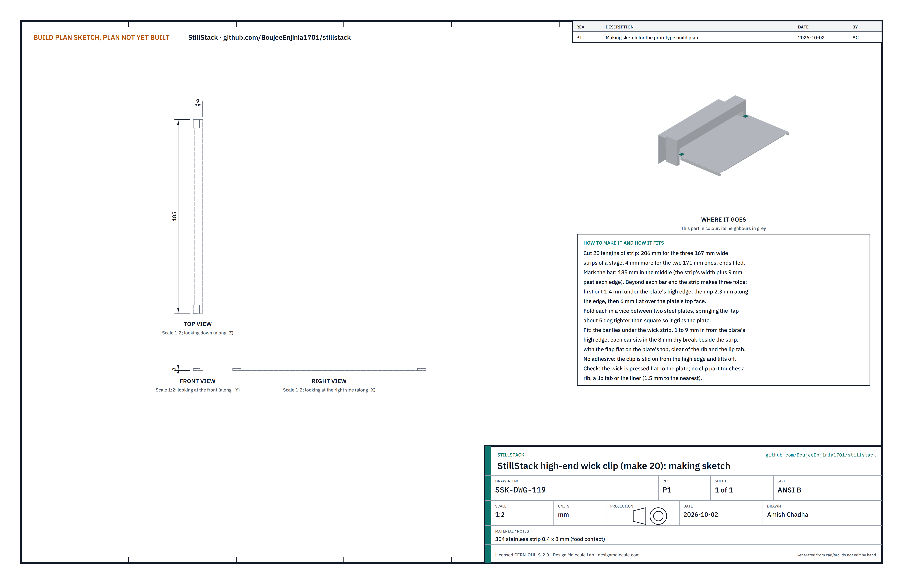

*Figure 24. High-end wick clip making sketch (SSK-DWG-119): a 0.4 x 8 mm stainless strip, shown for the centre strip of a stage.*

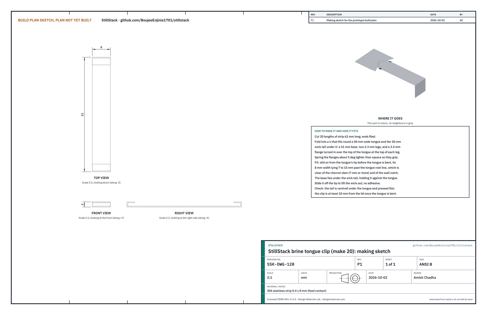

*Figure 25. Brine tongue clip making sketch (SSK-DWG-120).*

**The two clips.** Both are folded by hand from 0.4 x 8 mm 304 stainless strip, 20 of each (40 in all). The high-end clip is 206 mm long for a 167 mm strip: a 185 mm bar under the wick, and at each end three folds that carry an ear out under the plate's high edge, up along it and 6 mm flat over its top face, in the dry break beside the strip. The tongue clip is 62 mm long: a 51 mm base under the wick tail, two 2.3 mm legs up the sides of the brine tongue and a 3.4 mm flange turned in over the tongue's top face. Spring the flaps about 5° tighter than square so they grip. Neither clip touches a rib, a lip tab, the liner or the lid (the nearest is 1.5 mm).

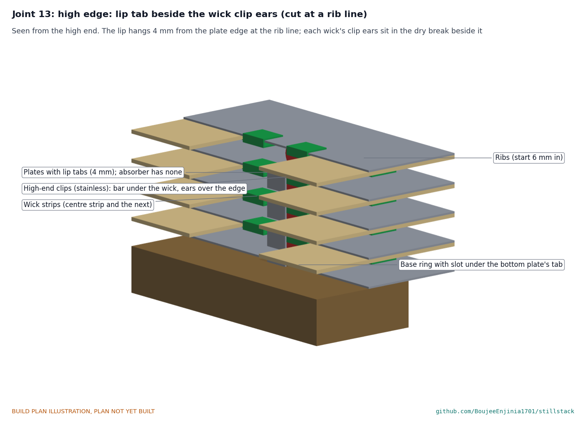

*Figure 26. Seen from the high end, cut at a rib line: the lip hangs 4 mm from the plate edge at the rib line, and each wick's clip ears sit in the dry break beside the strip.*

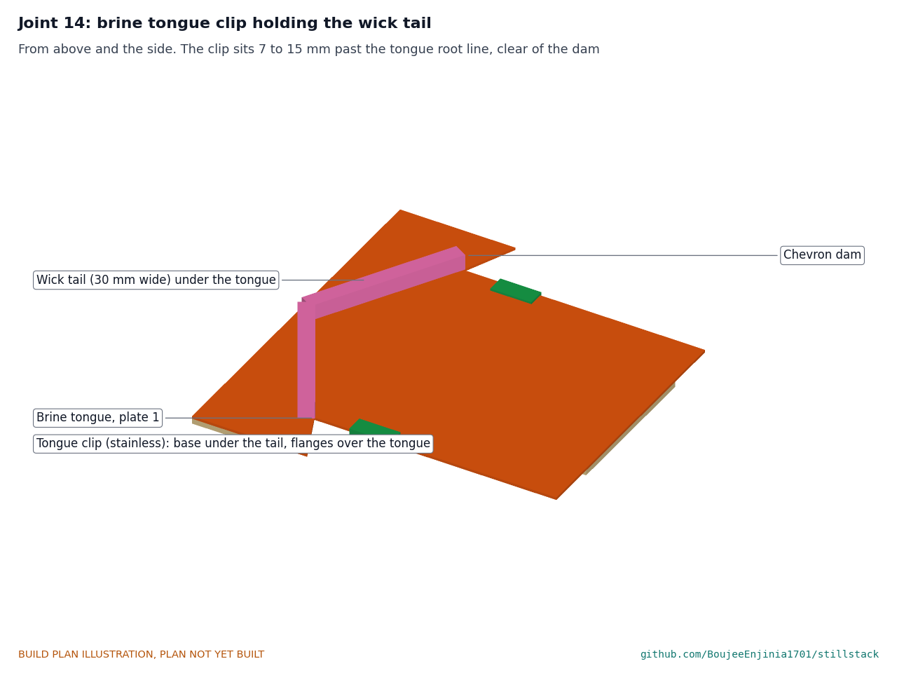

*Figure 27. The tongue clip holds the 30 mm wick tail under the 50 mm brine tongue, 7 to 15 mm past the root line and clear of the chevron dam.*

**Check before moving on.** No fibre bridges a dry break; each tail is centred on its tongue.

### 3.12 Absorber plate

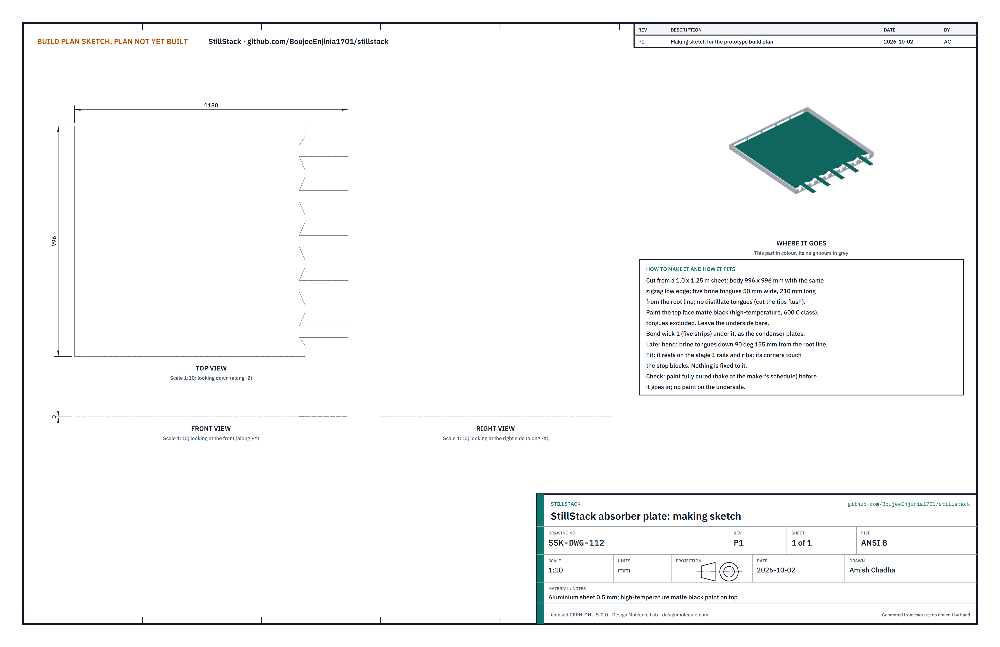

*Figure 28. Absorber plate making sketch (SSK-DWG-112).*

**What it is and what it is made from.** The top plate that absorbs the sunlight; stage 1's wick is bonded under it. Aluminium sheet 0.5 mm with high-temperature matte black paint on top.

**How to make it.**

1. Cut the same body and zigzag edge as the other plates, with five brine tongues 50 mm wide and 210 mm long from the root line and no distillate tongues (cut the tips flush). Mark the brine bend line 155 mm from the root line.
2. Paint the top face matte black with a high-temperature paint (600 °C class), tongues excluded, and cure it to the maker's schedule. Leave the underside bare.
3. Bond the five strips of wick 1 under it.

**How it fits the parts next to it.** It rests on the stage 1 rails and ribs, its corners against the stop blocks. Nothing is fixed to it.

**Check before moving on.** The paint is fully cured; there is no paint on the underside.

### 3.13 Glazing trim (make 4)

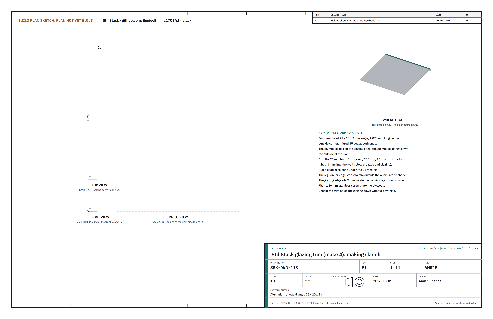

*Figure 29. Glazing trim making sketch (SSK-DWG-113).*

**What it is and what it is made from.** The frame that holds the glazing down on the walls. Aluminium unequal angle 25 x 20 x 2 mm.

**How to make it.**

1. Cut four lengths 1,078 mm on the outside corner, mitred 45° at both ends.
2. Drill the 20 mm leg 4.5 mm every 200 mm, 15 mm from its top edge.

**How it fits the parts next to it.**

*Figure 30. The 25 mm leg lies on the glazing edge over a bead of silicone; the 20 mm leg hangs down the outside of the wall (detail of Figure 19).*

The glazing sits on 3 mm foam tape on the wall tops, its edge 7 mm inside the trim's hanging leg so it can grow when hot. The trim's top leg stops 14 mm outside the aperture, so it casts no shade. Four 4 x 20 mm stainless screws per length go through the hanging leg into the plywood.

**Check before moving on.** The trim holds the glazing down without bowing it.

### 3.14 Distillate manifold lid

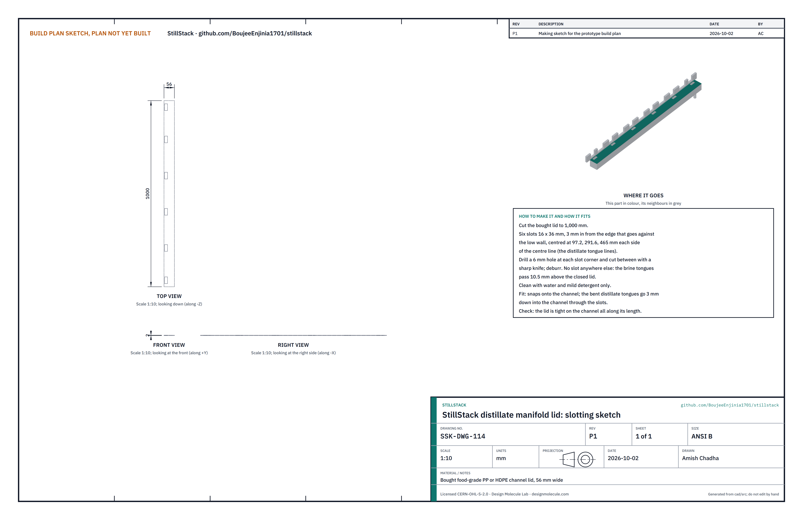

*Figure 31. Manifold lid slotting sketch (SSK-DWG-114).*

**What it is and what it is made from.** The lid of the bought food-grade channel that collects the distillate. Six slots let the distillate tongues in; everywhere else the lid is closed, so brine dripping above it cannot reach the distillate.

**How to make it.**

1. Cut the channel and its lid to 1,000 mm.
2. Cut six slots 16 x 36 mm in the lid, 3 mm in from the edge that goes against the low wall, centred 97.2, 291.6 and 465 mm each side of the centre line. Drill a 6 mm hole at each corner and cut between them with a sharp knife.
3. Clean with water and mild detergent only.

**How it fits the parts next to it.**

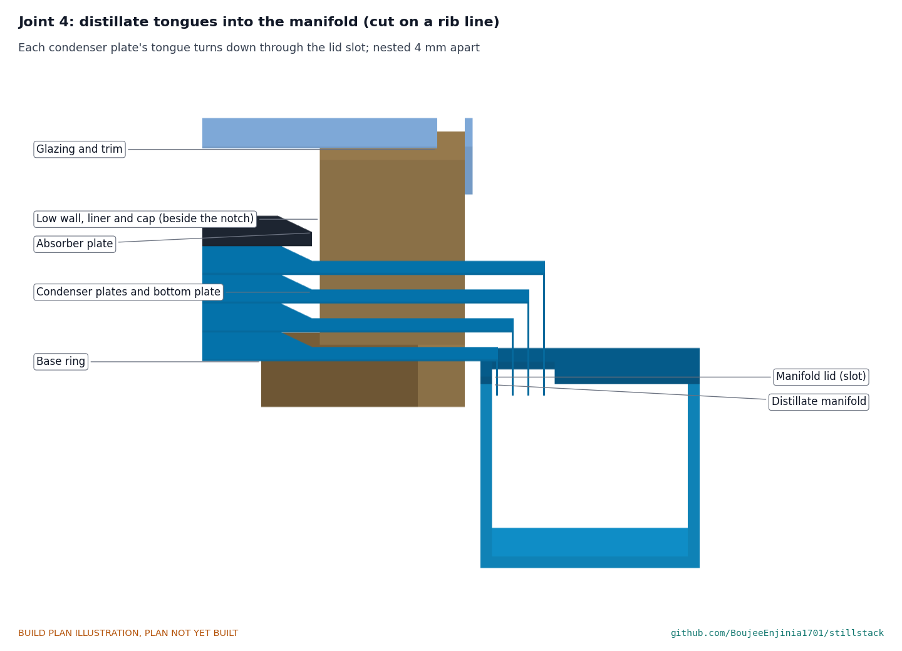

*Figure 32. Cut on a rib line: each condenser plate's tongue turns down through the slot, 4 mm outside the one below, and ends 3 mm inside the channel.*

**Check before moving on.** The lid is tight on the channel all along its length; the slots line up with the notches in the low wall.

### 3.15 Outlet brackets (make 2)

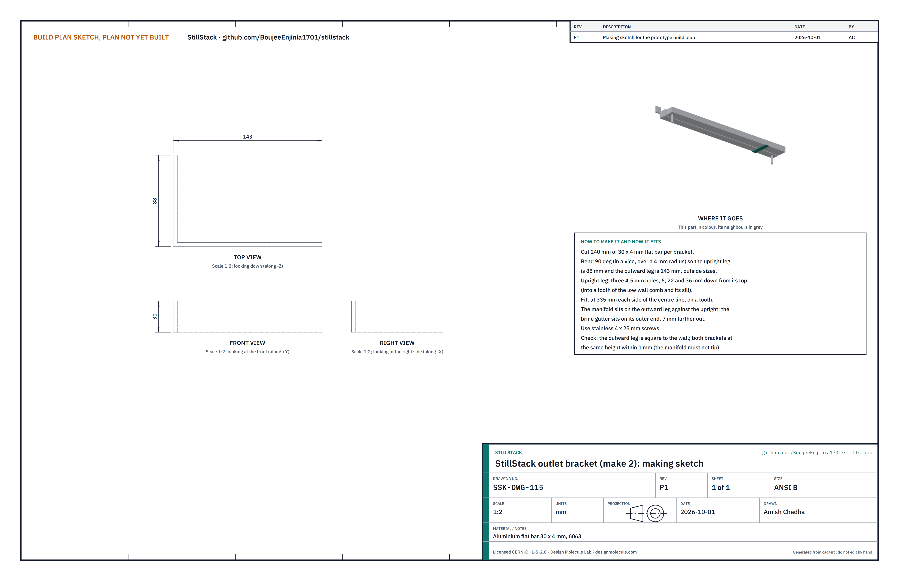

*Figure 33. Outlet bracket making sketch (SSK-DWG-115).*

**What it is and what it is made from.** Two L-shaped brackets on the low wall that carry the manifold and the brine gutter. Aluminium flat bar 30 x 4 mm.

**How to make it.**

1. Cut 240 mm of bar for each bracket.
2. Bend 90° in a vice over a 4 mm radius so the upright leg is 88 mm and the outward leg 143 mm, outside sizes.
3. Drill three 4.5 mm holes in the upright leg, 6, 22 and 36 mm down from its top.

**How it fits the parts next to it.**

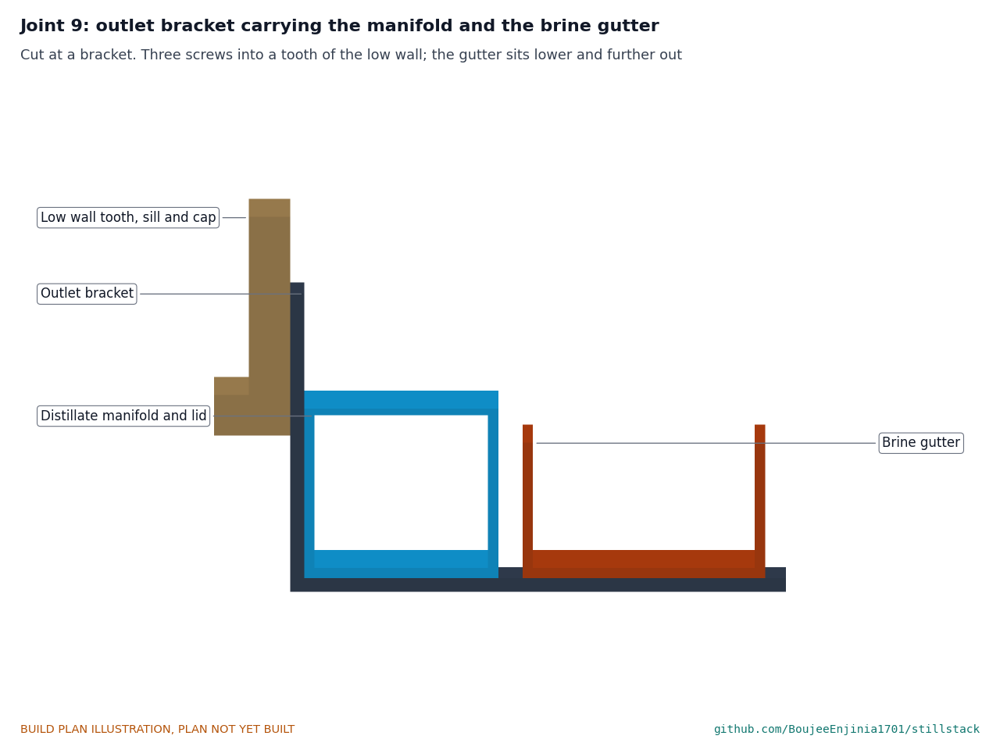

*Figure 34. Cut at a bracket: the manifold sits against the upright; the gutter sits on the outer end, lower and further out.*

Each bracket is screwed (4 x 25 mm stainless) to a tooth of the low wall comb and its sill, 335 mm each side of the centre line.

**Check before moving on.** The outward legs are square to the wall and level with each other within 1 mm.

### 3.16 Ground frame

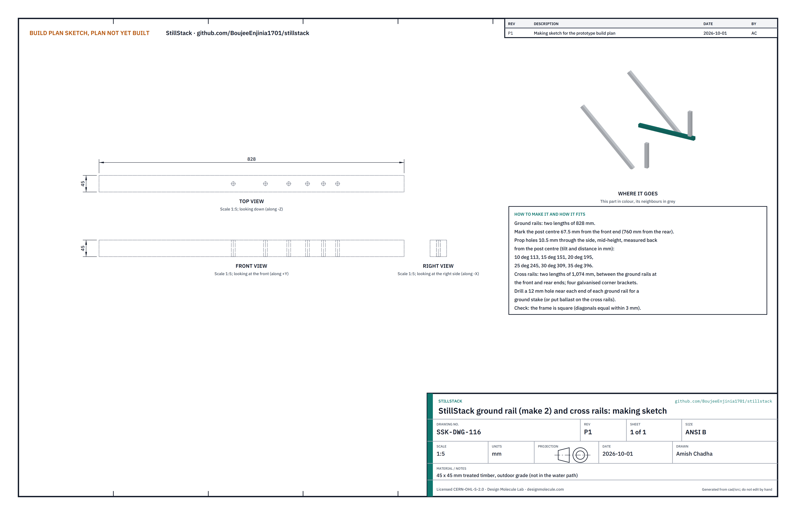

*Figure 35. Ground rail making sketch (SSK-DWG-116), with the six prop holes.*

**What it is and what it is made from.** Two ground rails and two cross rails that the stand stands on. 45 x 45 mm treated timber (it never touches the water).

**How to make it.**

1. Cut two ground rails 828 mm and two cross rails 1,074 mm.
2. On each ground rail, mark the post centre 67.5 mm from the front end.
3. Drill six 10.5 mm holes through the side, at mid-height, measured back from the post centre: 113 mm (10°), 151 mm (15°), 195 mm (20°), 245 mm (25°), 309 mm (30°) and 396 mm (35°). Drill the two rails clamped together.
4. Drill a 12 mm hole near each end of each ground rail for a ground stake.

**How it fits the parts next to it.** The cross rails fit between the ground rails at the front and rear ends with four galvanised corner brackets. The posts stand on the rails at their marks; the props pin to the outside of the rails.

**Check before moving on.** The frame is square, with diagonals equal within 3 mm.

### 3.17 Front posts and gussets (make 2 of each)

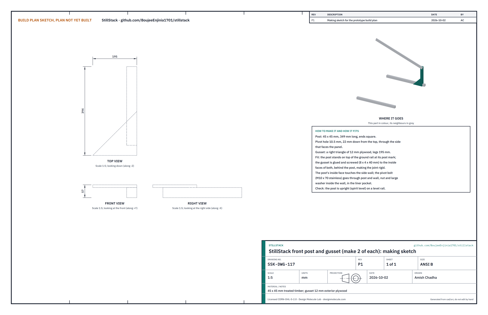

*Figure 36. Front post and gusset making sketch (SSK-DWG-117).*

**What they are and what they are made from.** The posts that carry the panel's pivot, made rigid on the ground rails by plywood gussets. 45 x 45 mm treated timber; gussets 12 mm exterior plywood.

**How to make them.**

1. Cut two posts 349 mm long, ends square.
2. Drill the pivot hole 10.5 mm, 22 mm down from the top, through the side that faces the panel.
3. Cut two right-triangle gussets with legs of 195 mm.

**How they fit the parts next to them.**

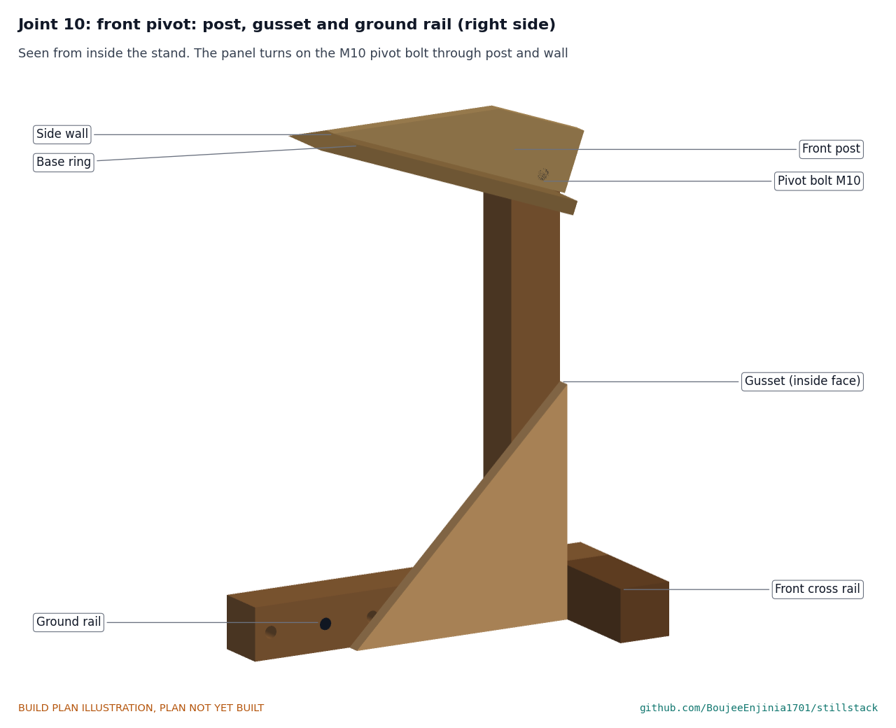

*Figure 37. Seen from inside the stand: the gusset joins post and rail behind the post; the M10 pivot bolt goes through the post and the side wall.*

Each post stands on top of its ground rail at the mark; the gusset is glued and screwed (eight 4 x 40 mm screws) to the inside faces of post and rail, behind the post. The post's inside face touches the side wall, and an M10 x 70 stainless bolt through post and wall, with a large washer and nut inside the wall in the liner pocket, is the pivot.

**Check before moving on.** Each post is upright on the level frame (spirit level).

### 3.18 Props (make 2)

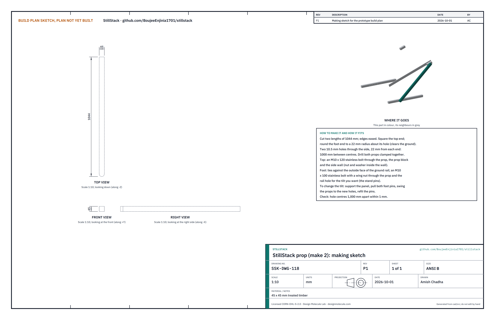

*Figure 38. Prop making sketch (SSK-DWG-118).*

**What it is and what it is made from.** A fixed-length strut on each side from the prop block to the ground rail; the hole it is pinned in sets the tilt. 45 x 45 mm treated timber.

**How to make it.**

1. Cut two lengths of 1,044 mm and ease the edges. Leave the top end square; round the foot end to a 22 mm radius about its hole so it clears the ground at every tilt.
2. Drill two 10.5 mm holes through the side, 22 mm from each end, 1,000 mm between centres, with the two props clamped together.

**How it fits the parts next to it.**

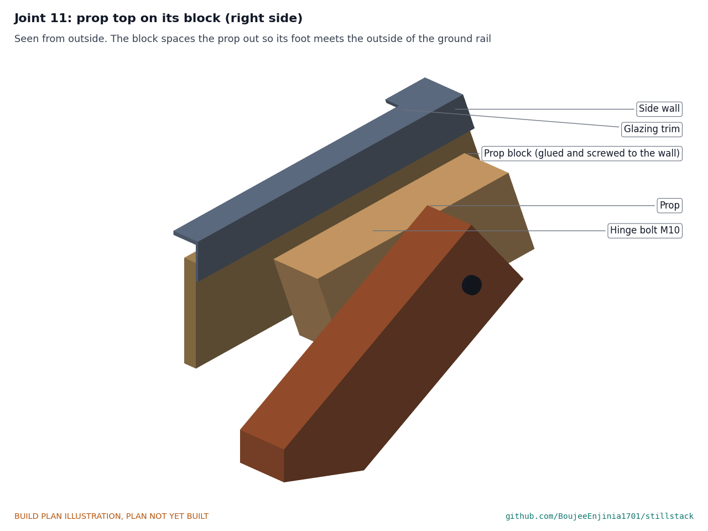

*Figure 39. The prop hinges on an M10 bolt through the prop, the prop block and the side wall.*

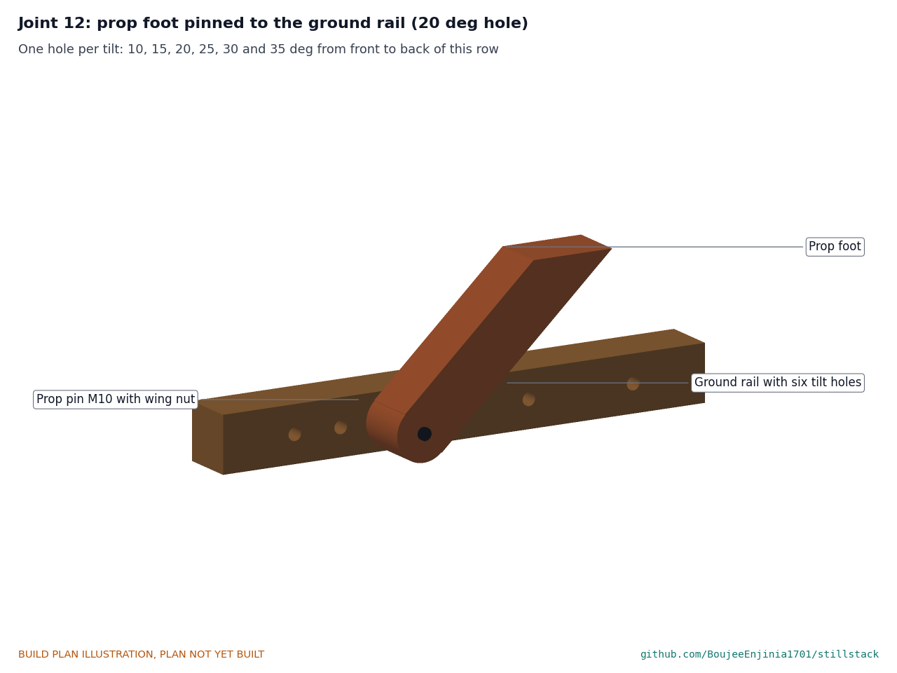

*Figure 40. The foot lies against the outside of the ground rail and is pinned through the hole for the chosen tilt.*

The top: an M10 x 120 stainless bolt through prop, block and wall, nut and washer inside the wall. The foot: an M10 x 100 stainless bolt with a wing nut through the prop and the rail hole for the tilt. To change the tilt, support the panel, pull both foot pins, swing the props to the new holes and refit the pins.

**Check before moving on.** Hole centres are 1,000 mm apart within 1 mm.

### 3.19 Bought components

Buy to specification, not brand. Line numbers are those of the bill of materials.

- **Glazing (line 1).** 6 mm twin-wall UV-stabilised clear polycarbonate, cut to 1,060 mm square with the flutes running down the slope; breather tape for the flute ends.
- **Liner (line 2).** Foil-faced stone wool board 25 mm, rated well above 150 °C, compressive strength 10 kPa or more.
- **Ribs (line 7).** 7 mm food-grade silicone round cord.
- **Feed trough (line 8).** PVC or HDPE gutter about 70 x 70 mm, 1.0 m, with end caps, a drip valve at the front end and two fascia gutter brackets.
- **Distillate manifold (line 9).** Food-grade PP or HDPE channel about 56 x 50 mm with a snap-on lid, 1.0 m, with an outlet near one end and silicone outlet tube to a clean covered container.
- **Brine gutter (line 10).** PVC gutter about 70 x 40 mm, 1.0 m, with an outlet at the other end and a drain hose.
- **Sealant, fasteners and tubing (line 13).** NSF/ANSI 51 or 61 food-grade silicone sealant; high-temperature silicone adhesive; exterior polyurethane glue; stainless screws (4 x 20, 4 x 25, 4 x 30 and 4 x 40 mm); silicone tube.
- **Stagnation cover (line 14).** Opaque white or aluminised tarpaulin 1.3 x 1.3 m with an elastic edge cord.
- **Glazing tape (line 15).** Silicone foam tape 3 x 30 mm, 4.3 m.
- **Feed closure (line 17).** Closed-cell silicone foam strip 5 x 35 mm, 1.0 m.
- **Wick clips (line 18).** 0.4 x 8 mm 304 stainless strip, about 5.5 m (one 6 m coil), cut and folded in the workshop.
- **Labels (line 19).** Two UV-stable vinyl or engraved aluminium labels, 80 x 25 mm, DISTILLATE beside the manifold outlet and BRINE beside the brine drain.
- **Stand hardware (line 12).** Two M10 x 70 and two M10 x 120 stainless bolts with nuts and large washers; two M10 x 100 stainless bolts with wing nuts; four galvanised corner brackets; four ground stakes.

## 4. Putting it together

In each picture the parts already fitted are grey and the parts being fitted are in colour, with an arrow showing the way they go in. Steps 1 to 18 are done with the panel lying level on a bench; steps 19 to 22 build the stand and put the panel on it.

### Step 1: end walls between the side walls

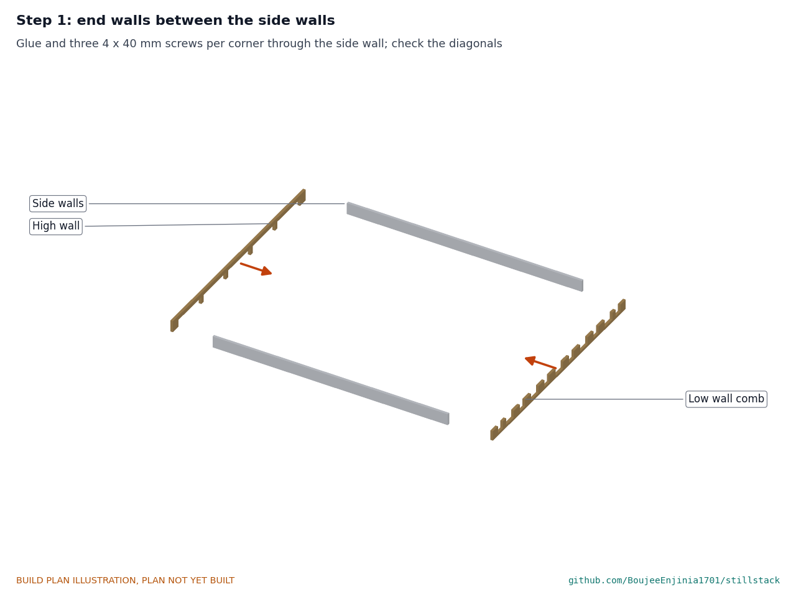

Glue and three 4 x 40 mm screws per corner through the side wall into the high wall and the low wall comb. Check the diagonals are equal within 2 mm before the glue sets.

### Step 2: base ring under the walls

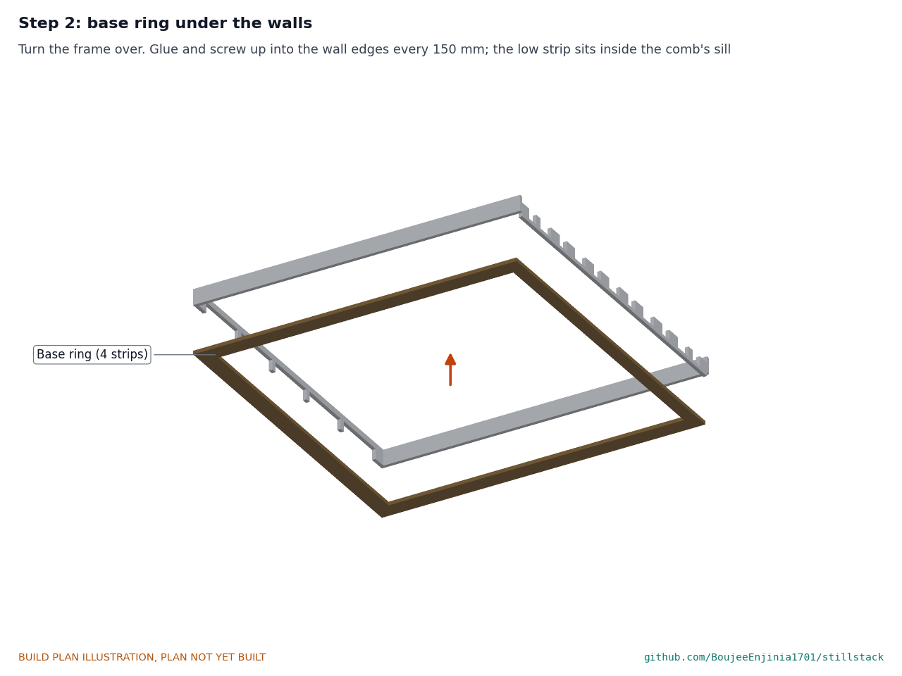

Turn the frame over. Glue and screw the four strips up into the wall edges every 150 mm; the low strip sits inside the comb's sill.

### Step 3: liner into the frame

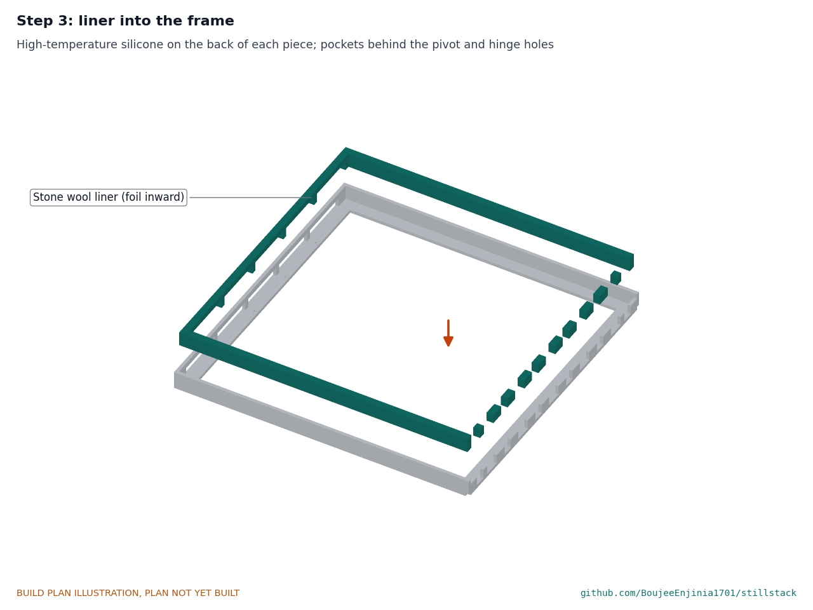

High-temperature silicone on the back of each piece, foil toward the stack, pockets behind the pivot and hinge holes. Keep the low blocks between the wall's notches.

### Step 4: stop blocks into the low corners

High-temperature silicone on the back and side faces. The prop blocks are already on the side walls (section 3.1).

### Step 5: bottom plate and fins onto the base ring

Lower it level, fins down; the six tongues drop into the comb's notches and rest on the sill. Its corners touch the stop blocks.

### Step 6: stage 4 rails, ribs and plate 3

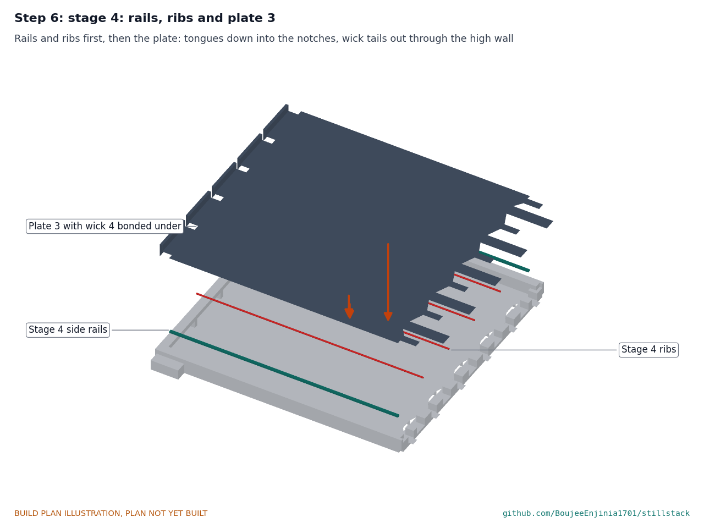

Lay the two stage 4 rails flush with the side edges, low ends on the stop blocks, and the four ribs on the rib lines. Lower plate 3, with wick 4 clipped under it (ten clips), so its tongues drop into the notches; feed the wick tails out through the high wall openings. Then run the chevron dams on plate 3's top face. **Hold point:** with a 6 mm gauge, the gap is even at the four corners and on each rib line.

### Step 7: stage 3 rails, ribs and plate 2

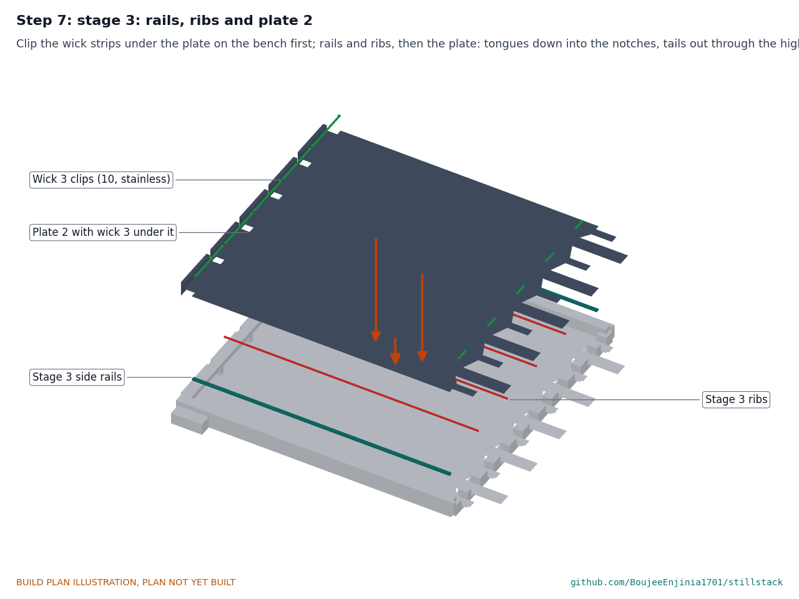

As step 6, with the stage 3 rails and plate 2 (wick 3 clipped under it); then the dams on plate 2.

### Step 8: stage 2 rails, ribs and plate 1

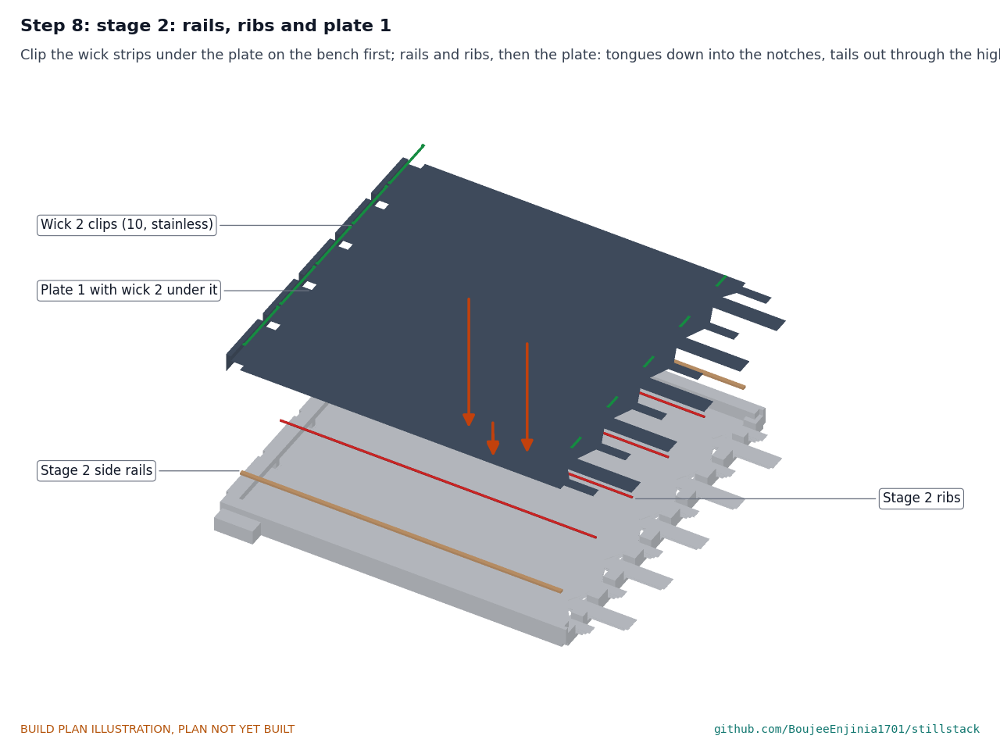

As step 6, with the stage 2 rails (PPS) and plate 1 (wick 2 clipped under it); then the dams on plate 1.

### Step 9: stage 1 rails, ribs and the absorber

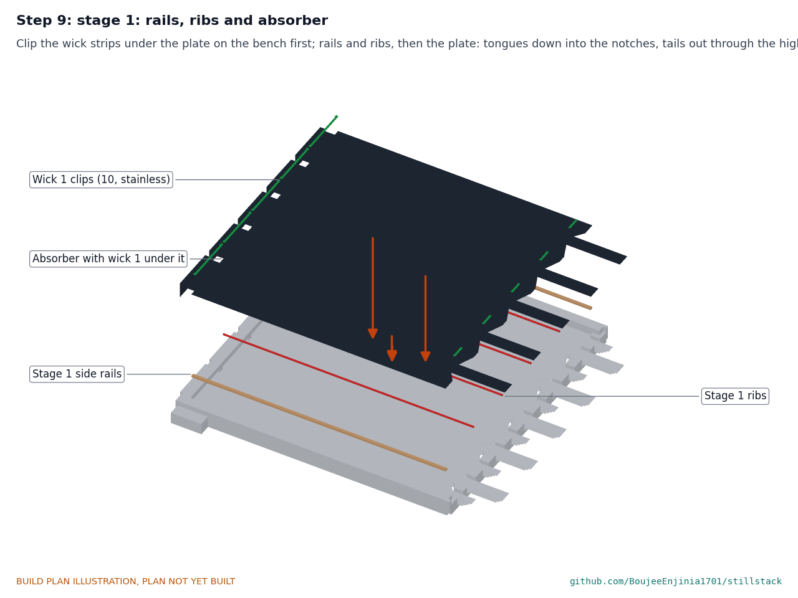

As step 6, with the stage 1 rails (PPS) and the absorber (wick 1 clipped under it), black face up. **Hold point:** no wick fibre bridges a dry break, every tail is centred on its brine tongue, and no tongue touches the side of its notch.

### Step 10: low wall cap

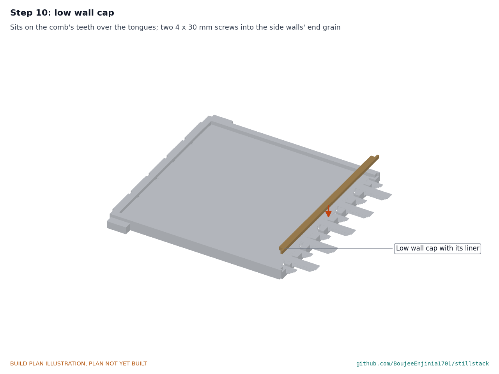

Sits on the comb's teeth over the tongues; two 4 x 30 mm screws into the side walls' end grain.

### Step 11: glazing tape and glazing

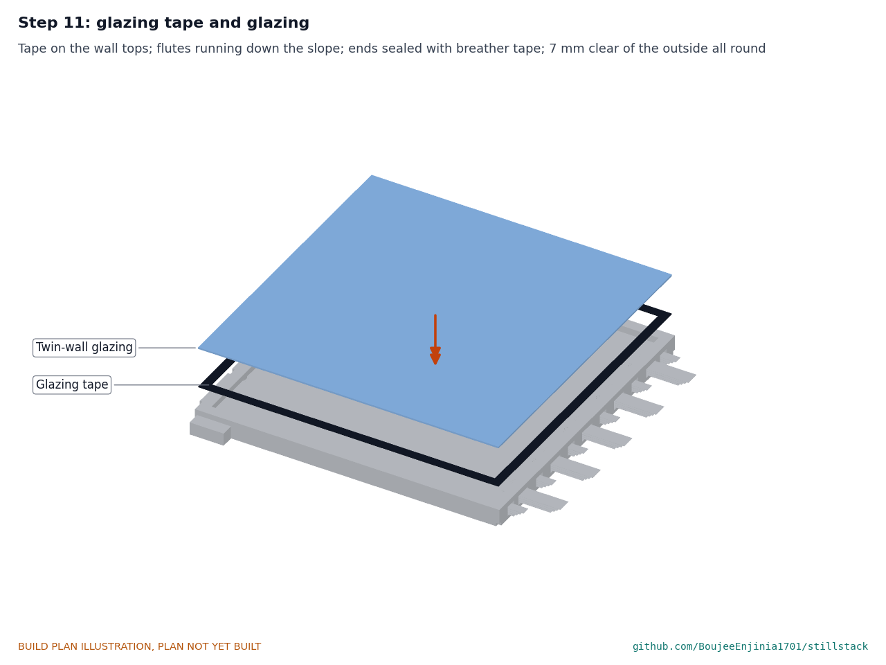

Tape on the wall tops, glazing on the tape with the flutes running down the slope and the flute ends sealed with breather tape, 7 mm clear of the outside of the walls all round.

### Step 12: glazing trim

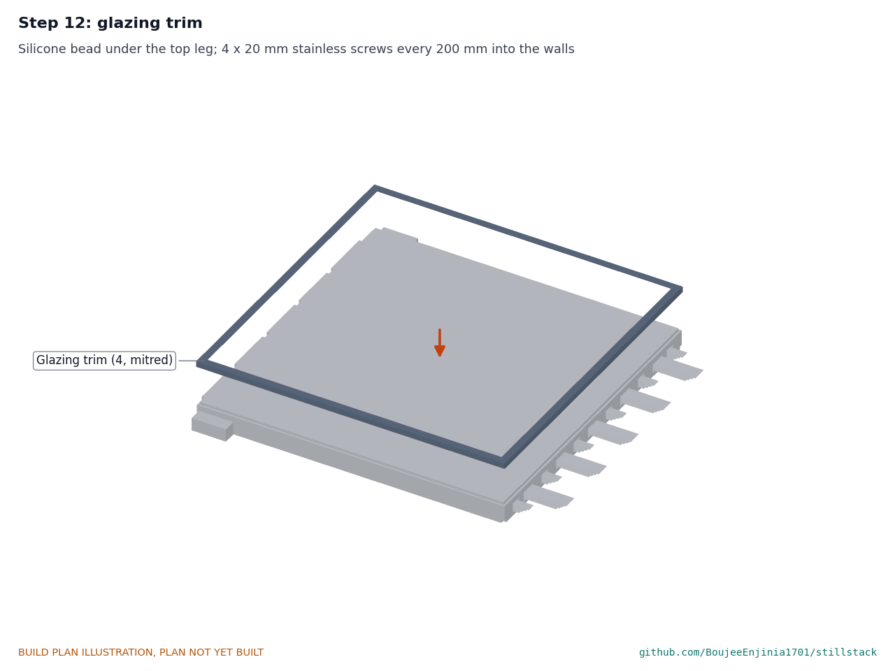

A bead of silicone under the top leg; 4 x 20 mm stainless screws every 200 mm through the hanging leg into the walls.

### Step 13: outlet brackets onto the low wall

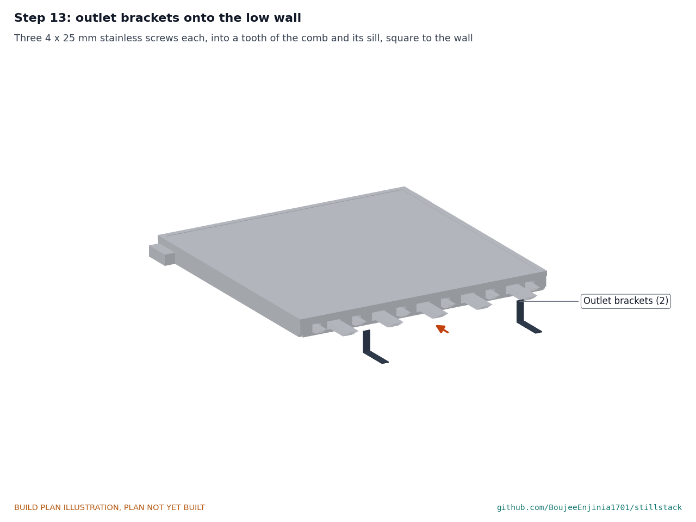

Three 4 x 25 mm stainless screws each into a tooth of the comb and its sill, square to the wall and level with each other.

### Step 14: distillate manifold and lid


Snap the lid onto the channel first. Slide the manifold in from outside, under the straight tongues, onto the brackets and against their uprights, outlet at the right-hand end as you face the low wall, with the lid's slots under the distillate tongues.

### Step 15: bend the distillate tongues into the lid slots


Lowest plate first, bend each tongue down over a hardwood block at its bend line so it drops 3 mm into the channel through its slot. **Hold point:** no distillate tongue touches a brine tongue or a wick tail.

### Step 16: brine gutter onto the bracket ends


Outboard of and lower than the manifold, drain at the left-hand end, away from the distillate outlet.

### Step 17: bend the brine tongues into the gutter


Lowest first, each 4 mm outside the one below, so each ends inside the gutter with its wick tail under it. **Hold point:** every brine tongue and tail is at least 10 mm above the closed lid along its whole length (use a 10 mm gauge).

### Step 18: feed trough and foam closure


Screw the two fascia brackets to the high wall's solid ends; glue the foam strip to the trough's inner wall; set the trough in the brackets and lead every feed tail up the wall, over the rim and down into the trough.

### Step 19: ground frame


Cross rails between the ground rails with the four corner brackets. Set the frame level on firm ground and stake or ballast it.

### Step 20: front posts and gussets


Each post on top of its rail at the mark; gusset glued and screwed to the inside faces behind the post.

### Step 21: panel onto the front posts


Two people, panel dry, cover on. Lift the panel between the posts, fit the M10 pivot bolts through posts and side walls, and rest the high end on a trestle. **Hold point:** safety stop S4 in section 6.

### Step 22: props from the prop blocks to the tilt holes


M10 hinge bolt through each prop, block and wall; foot pin with wing nut through the rail hole for the tilt wanted (20° shown). Remove the trestle only when both pins are in.

## 5. First checks

These are the checks a TRL 4 test report would record; this plan only lists them. Requirement numbers are those of SSK-REQ-001.

*Table 2. First checks.*

| Check | Requirement | How | Pass when |
| --- | --- | --- | --- |
| Gaps | R1, R2 | 6 mm gauge at the corners and rib lines of every gap during steps 6 to 9 | Every gap 6 mm, give or take 0.5 mm |
| Dry breaks and brine clearance | R4 | Look along every wick edge; 10 mm gauge between each brine tongue or tail and the lid | 10 mm of dry plate beside every rib and rail; 10 mm or more everywhere above the lid |
| Separation, coloured water | R4, R3 | Panel at 20° in shade, cover on; food dye in the feed; run 2 hours | No colour in the manifold or its outlet |
| Wicks lift out | R10 | Slide off the tongue clips, unhook the high-end clips, lift one wick strip and refit it; time it | A strip comes out and goes back in a few minutes without tearing |
| Plates lift out | R10 | Remove the cap, lift the absorber and one condenser plate, refit; time it | The plates come out and go back without bending a tongue |
| Tilt range | R11 | Pin the props at each of the six holes; angle finder on the glazing | 10° to 35°, each within 1° of its hole |
| Mass and footprint | R9 | Weigh the panel dry; measure the stand at 10° | 20 kg or less dry (18.7 kg estimated); within 1.3 x 1.3 m |
| Feed head | R5 | Measure the trough rim height at 35° | 1.5 m or less (1.00 m estimated) |
| Food-contact surfaces | R7 | Check the coating, manifold, lid, tube and silicone against their datasheets | Every distillate-side surface food-contact rated |
| First sun | R1, R2, R8 | Feed running, cover off, a clear day; outputs per stage and absorber temperature logged | Recorded for the TRL 4 report; feed never runs out |
| Distillate quality | R3 | Conductivity of each stage's distillate | 75 µS/cm or less |

## 6. Safety stops

Stop at each point. Carry on only when everything listed is true.

- **S1. Before cutting.** Gloves and glasses for aluminium sheet and snips; gloves, glasses and a dust mask for stone wool; hearing protection for the jigsaw; a ventilated space for paint, primer and the printer.
- **S2. Before painting the absorber or coating the plates.** Ventilation and a respirator as the product's datasheet says; no flame nearby; cure to the maker's schedule before the plate goes in.
- **S3. Before closing the stack (step 10).** Every surface on the distillate side (coating, lid, manifold, tube, silicone) is food-contact rated; no treated timber, lead solder or container of unknown history anywhere in the water path.
- **S4. Before lifting the panel onto the stand (step 21).** Two people; the panel dry (about 18.7 kg); the ground frame staked or ballasted; the cover on.
- **S5. Before the panel faces the sun.** The stand staked or ballasted (the panel can overturn at about 18 m/s of wind); the feed container full and the drip valve open; the stagnation cover at hand. Never leave the panel in sun with an empty feed: a dry stack reaches about 140 °C.
- **S6. Before opening or working on the stack.** The cover on and the panel cool to the touch.
- **S7. Before anyone drinks the distillate.** Tested for at least conductivity and E. coli, stored in a clean covered container and disinfected. The prototype's distillate is test water until then.
- **S8. Brine.** Led to a soak-away or evaporation pond away from crops, wells and soil that must stay fresh.

## 7. Tools, skills and workspace

**Tools.** Circular saw or a fine-toothed handsaw with a straight-edge guide for ripping plywood; jigsaw with wood and fine metal blades; drill with bits from 2.5 to 12 mm; chisel and mallet; files and a deburring tool; aviation snips; two straight hardwood battens and a vice for folding the fins; two steel plates and tin snips for the stainless clips and the lip tabs; steel rule, engineer's square, angle finder and spirit level; a 6 mm and a 10 mm gauge (offcuts of rail stock); long bread knife for the stone wool; caulking gun; screwdrivers; clamps; a 3D printer with an enclosure and a heated bed that prints polycarbonate; a scale to 30 kg.

**Skills.** No certified trade is needed. Basic woodwork (ripping, notching, gluing and screwing), cutting and folding thin aluminium sheet, careful cutting of fabric and insulation board, printing polycarbonate, and neat work with silicone. There is no electricity in the product.

**Workspace.** A flat bench at least 1.3 x 1.3 m, or two trestles with a sheet of plywood; a clean area kept apart from sawdust for coating the plates and fitting the wicks; a ventilated place for paint and printing; a shaded outdoor spot for the stand.

**Personal protective equipment.** Safety glasses throughout; cut-resistant gloves for aluminium; gloves and a dust mask for stone wool; hearing protection for sawing; a respirator for spray paint or coating as their datasheets say.

## 8. Where the numbers come from

- Model and constructability checks: `cad/src/model.py` (`python cad/src/model.py --check`); STEP and STL exports in `cad/step/` and `cad/stl/`.
- Pictures: `cad/src/build_plan_media.py`, using `.kit/build_views.py`; written to `docs/05-build-plan/` and `cad/drawings/SSK-DWG-101` to `SSK-DWG-120`.
- General arrangement: `cad/drawings/SSK-DWG-002.pdf`, Rev P4.
- Calculations: `docs/04-calcs/01-sizing.md` (SSK-CAL-001 v0.6) and `docs/04-calcs/sizing.py`; plate support [section 3], mass, tilt and footprint [section 8], wind [section 9], construction checks [section 13].
- Bill of materials: `bom/bom.csv`.
- Decisions: `docs/decisions/0003-design-for-construction.md` (SSK-DDR-003), with SSK-DDR-001 and SSK-DDR-002; open items in `docs/06-design-decisions.md` (SSK-DEC-001).
- Requirements: `docs/03-requirements.md` (SSK-REQ-001 v0.8).
